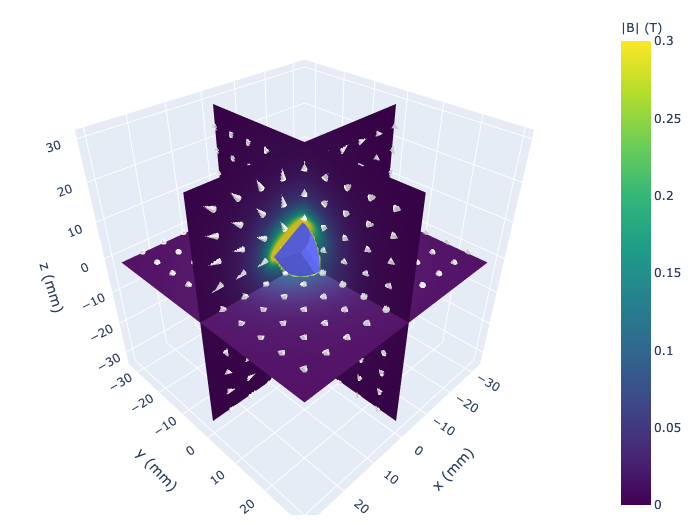
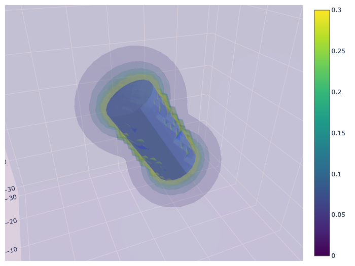
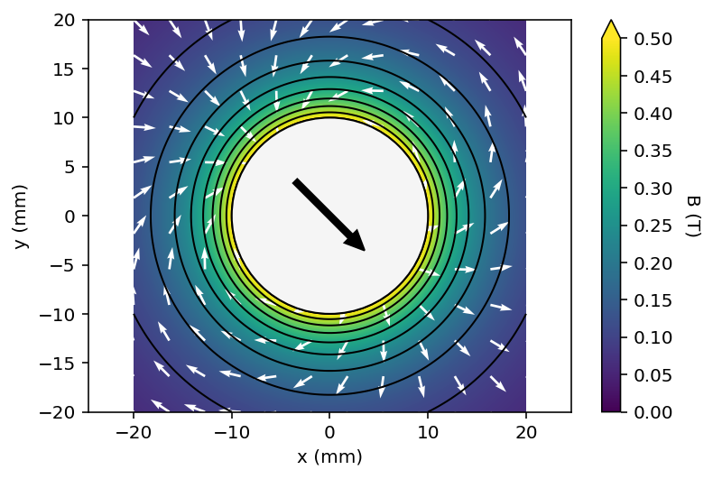
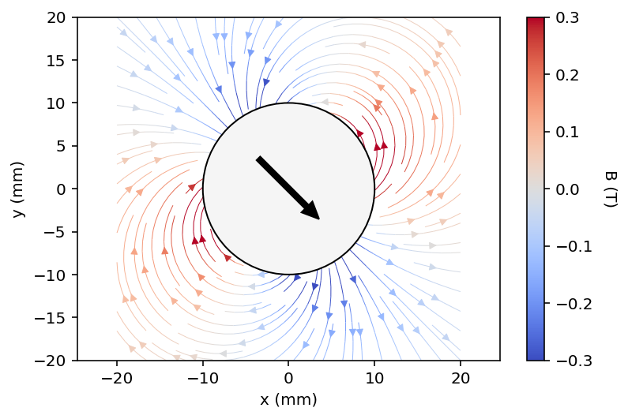

# Pymagnet

User friendly magnetic field calculations in Python

[](https://opensource.org/licenses/MPL-2.0)
[](https://creativecommons.org/licenses/by-sa/4.0/)
[](https://zenodo.org/badge/latestdoi/339667292)
[](https://anaconda.org/pdunne/pymagnet)

## Getting Started

Installing `pymagnet` can be done using

```bash
python -m pip install pymagnet 
```

Pymagnet is a collection of routines to calculate and plot the magnetic field due to arbitrary 2D
and 3D objects, like cubes or cylinders, as well as complex non-convex structures stored in STL
files. The library can also calculate the magnetic forces and torques on one magnet due to all other magnets in the system.

The approach assumes the magnets are uniformly magnetised, and fully transparent to magnetic fields.
There are some drawbacks to this compared to Finite Element Methods (FEM), but with the advantage of
significantly faster calculations.

The current version is written in Python with some speed up using [Numpy](https://numpy.org/) and
[Numba](https://numba.pydata.org/), but the backend is being ported to
[Rust](https://github.com/pdunne/magnet_rs) for improved performance.

## Features

This code uses analytical expressions to calculate the magnetic field due to
simple magnets:

* 3D: cubes, prisms (cuboids), cylinders, spheres

<figure>
  
  
  <figcaption>Cylinder Plots</figcaption>
</figure>

* 2D: rectangles, squares, circles

<figure>
  
  
  <figcaption>2D contour plot and streamplot of a long bipolar rod</figcaption>
</figure>

and complex compound objects:

* 3D: Polyhedra stored as STL meshes
* 2D: Polygons constructed from collections of line elements

There are helper functions to plot the data as line, contour, slice, and volume plots,
but the underlying data is also accessible.

## Documentation

Full documentation can be found here: [https://pdunne.github.io/pymagnet/](https://pdunne.github.io/pymagnet/)

### Examples

Examples can be found [in the repository](https://github.com/pdunne/pymagnet/tree/main/examples).

**Or run on Colab:**

#### 2D Examples

Getting Started [](https://colab.research.google.com/github/pdunne/pymagnet/blob/main/examples/notebooks/First%20Steps.ipynb)

1D Simple Plots [](https://colab.research.google.com/github/pdunne/pymagnet/blob/main/examples/notebooks/Fields/1D%20Examples.ipynb)

2D Standard Shapes [](https://colab.research.google.com/github/pdunne/pymagnet/blob/main/examples/notebooks/Fields/2D%20Examples.ipynb)

2D Arbitrary Polygons [](https://colab.research.google.com/github/pdunne/pymagnet/blob/main/examples/notebooks/Fields/2D%20PolyMagnet.ipynb)

Misc. Examples [](https://colab.research.google.com/github/pdunne/pymagnet/blob/main/examples/notebooks/Fields/Misc%20Examples.ipynb)

#### 3D Examples

Analytical Shapes [](https://colab.research.google.com/github/pdunne/pymagnet/blob/main/examples/notebooks/Fields/3D%20Examples%20-%20Assemblies.ipynb)

Spheres [](https://colab.research.google.com/github/pdunne/pymagnet/blob/main/examples/notebooks/Fields/3D_Examples%20Spheres.ipynb)

3D STL Meshes [](https://colab.research.google.com/github/pdunne/pymagnet/blob/main/examples/notebooks/STL%20Magnets/STL%20Examples.ipynb)

3D Stanford Bunny [](https://colab.research.google.com/github/pdunne/pymagnet/blob/main/examples/notebooks/STL%20Magnets/Stanford%20Bunny.ipynb)

Upload Your Own Custom Magnet [](https://colab.research.google.com/github/pdunne/pymagnet/blob/main/examples/notebooks/STL%20Magnets/Colab%20Custom%20Magnet.ipynb)

#### Forces and Torques

Cubes [](https://colab.research.google.com/github/pdunne/pymagnet/blob/main/examples/notebooks/Forces%20Torques/Cubes.ipynb)

Cylinders [](https://colab.research.google.com/github/pdunne/pymagnet/blob/main/examples/notebooks/Forces%20Torques/Cylinders.ipynb)

Spheres [](https://colab.research.google.com/github/pdunne/pymagnet/blob/main/examples/notebooks/Forces%20Torques/Spheres.ipynb)

STL Cubes [](https://colab.research.google.com/github/pdunne/pymagnet/blob/main/examples/notebooks/STL%20Magnets/STL%20Examples.ipynb)

STL Pentagonal Prisms [](https://colab.research.google.com/github/pdunne/pymagnet/blob/main/examples/notebooks/STL%20Magnets/STL%20Forces%20Pentagon.ipynb)

### Binder

The example notebooks can be run as an instance using Binder:

[](https://mybinder.org/v2/gh/pdunne/pymagnet/main?filepath=examples%2Fnotebooks)

## Prerequisites

Ensure you have [Python](https://www.anaconda.com/) version >= 3.6
 (to use f-strings), and the following packages:

* numpy
* numpy-stl
* numba
* matplotlib
* plotly

## Usage

Forms of this library have been used in a number of projects including [Liquid flow and control without solid walls, Nature 2020](https://www.nature.com/articles/s41586-020-2254-4).

## Licensing

Source code licensed under the [Mozilla Public License Version 2.0](https://www.mozilla.org/en-US/MPL/2.0/)

Documentation is licensed under a Creative Commons Attribution-ShareAlike 4.0 International [(CC BY-SA 4.0)](https://creativecommons.org/licenses/by-sa/4.0/) license.

This is a human-readable summary of (and not a substitute for) the license, adapted from [CS50x](https://cs50.harvard.edu/x/2021/license/). Official translations of this license are available in other languages.

**You are free to:**

* **Share** — copy and redistribute the material in any medium or format.
* **Adapt** — remix, transform, and build upon the material.

**Under the following terms:**

* **Attribution** — You must give appropriate credit, provide a link to the license, and indicate if changes were made. You may do so in any reasonable manner, but not in any way that suggests the licensor endorses you or your use.
* **ShareAlike** — If you remix, transform, or build upon the material, you must distribute your contributions under the same license as the original
* No additional restrictions — You may not apply legal terms or technological measures that legally restrict others from doing anything the license permits.

### Contribution

Unless you explicitly state otherwise, any contribution intentionally submitted
for inclusion in the work by you shall be licensed as above, without any
additional terms or conditions.
