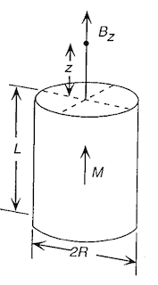
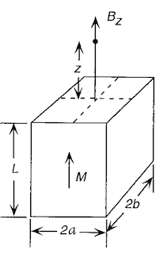
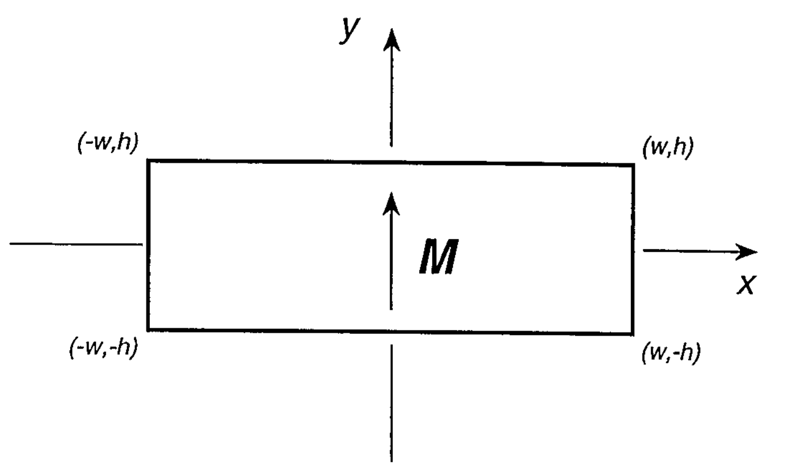
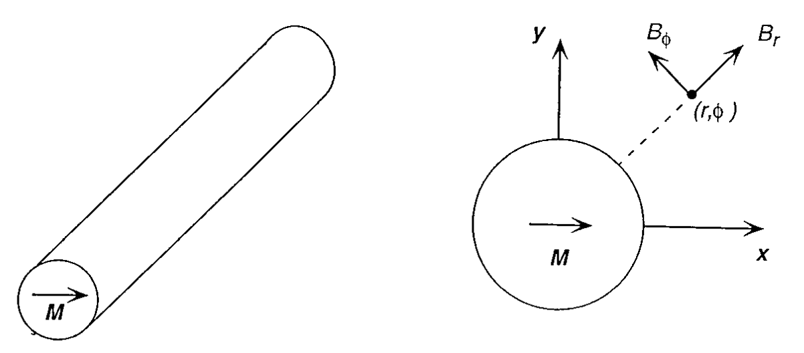

# Magnetic Field Equations

!!! note
    - SI Units with the Sommerfeld convetion are used for this discussion:
    $\mathbf{B} = \mu_0 \left( \mathbf{H} + \mathbf{M}  \right)$[^1]
    - However, the Kennelly Convetion is used for the creation of each magnet object
    in the library:
    $\mathbf{B} = \mu_0\mathbf{H} + \mathbf{J}$[^1]
    - In free space $\mathbf{B} = \mu_0 \mathbf{H}$
    - In magnetised bodies, the demagnetising field $\mathbf{H_d} = - N \mathbf{M}$,
    where $N$ is the demagnetising factor.

Many of the relations here come from[^2], those that do not are noted below, or
derived.

## 1D Calculations

### Cylinder

The magnetic field directly above the centre of a cylinder is:

<figure>
  
  <figcaption>Magnetic cylinder schematic</figcaption>
</figure>


$$
B_z = \frac{\mu_0 M_r}{2} \left[ \frac{z+L}{\sqrt{(z+L)^2 + R^2} } - \frac{z}{\sqrt{z^2 + R^2}} \right]
$$

### Cuboid

While for a cuboid, this equation is:
<figure>
  
  <figcaption>Magnetic cuboid</figcaption>
</figure>

$$
B_z = \frac{\mu_0 M_r}{2}  {\left[ \tan^{-1}{\left(
\frac{(z+L)\sqrt{a^2 + b^2 + (z+L)^2} }{ab}
\right)} - \tan^{-1}{\left( \frac{z\sqrt{a^2 + b^2 + z^2} }{ab}
\right)}
\right]}
$$

## 2D Calculations

For infinitely long objects, the field problems can be approximated in 2D, where the magnet field consists of:

$$
\mathbf{B} = B_x \mathbf{\hat{x}} + B_y\mathbf{\hat{y}}
$$

### Rectangles

<figure>
    
    <figcaption>2D Magnet Rectangle</figcaption>
</figure>

The magnetic field due to rectangle and magnetised in $x$ is:
TODO:
$$
B_x = \frac{\mu_0 M_r}{2\pi}
$$

$$
B_y = \frac{\mu_0 M_r}{4\pi}
$$

and if magnetised in $y$ is:

$$
B_x = \frac{\mu_0 M_r}{4\pi} \left[\ln {\left(
\frac{{\left(x+a\right)}^2 + {\left(y-b\right)}^2}{{\left(x+a\right)}^2
+{\left(y+b\right)}^2}
\right)}
-\ln{\left(
\frac{{\left(x-a\right)}^2+{\left(y-b\right)}^2}{ {\left(x-a\right)}^2 +
{\left(y+b\right)}^2}
\right)}\right]
$$

$$
B_y = \frac{\mu_0 M_r}{2\pi}
\left[{\tan}^{-1}{\left( \frac{2b \left(x+a\right)}{y^2-b^2+{\left(x+a\right)}^2}
\right)}
- {\tan}^{-1}{\left(\frac{2b\left(x-a\right)}{y^2-b^2+{\left(x-a\right)}^2}\right)}\right]
$$

### Biaxial Rods (Circle)

<figure>
  <!--  -->
    
    <figcaption>2D Magnet Circle</figcaption>
</figure>

A long bipolar rod of radius $a$ can be approximated as circular source. The magnetic
stray field is most conveniently written in polar coordinates, as:

$$
\mathbf{B} = \frac{\mu_0 M_r}{2} \left( \frac{a^2}{r^2}\right) \left[
    \cos(\phi) \mathbf{\hat{r}} + \sin(\phi) \mathbf{\hat{\phi}}
     \right]
$$


### Line Elements

The magnetic field due to an infinitely long, thin magnetic sheet of height $2h$
with a surface current density $\mathbf{K} = K_0 \mathbf{\hat{z}}$ is

$$
B_x = \frac{\mu_0 K_0}{4\pi} \ln \left( \frac{x^2 + (y-h)^2}{x^2 + (y+h)^2} \right)
$$

and

$$
B_y = \frac{\mu_0 K_0}{2\pi} \tan^{-1} \left( \frac{2hx}{x^2 + y^2 - h^2} \right)
$$

### Composite Polygons

An object consisting of two vertical sheets, one at $-w$ with $\mathbf{K} = -K_0 \mathbf{\hat{z}}$, and one
at $+w$ with with $\mathbf{K} = K_0\mathbf{\hat{z}}$ will produce the same field as a rectangular magnetic of
width $2w$, height $2h$, and remnant magnetisation $\mathbf{J_r} = J_y \mathbf{\hat{y}}$,

The surface current $\mu_0 \mathbf{K}$

$$
\mu_0 \mathbf{K} =  \mathbf{J} \times \mathbf{\hat{n}}  = \left( J_x n_y - J_y n_x  \right)\mathbf{\hat{z}}
$$

where  $\mathbf{\hat{n}} = n_x  \mathbf{\hat{x}}  + n_y  \mathbf{\hat{y}}  + 0  \mathbf{\hat{z}}$
is the unit normal vector to the magnetic sheet, and
$\mathbf{J} = J_x  \mathbf{\hat{x}}  + J_y  \mathbf{\hat{y}}  + 0  \mathbf{\hat{z}}$
is the remnant magnetisation vector of the composite polygonal magnet.

## 3D Calculations

The derived equations for 3D magnets were performed using the Coulombic Charge model
rather than the Amperian current model of the 2D systems. More correctly they are
derived in terms of the $H$ field rather than $B$, but which in free space only differ
by a factor $\mu_0$, i.e. $\mathbf{B} = \mu_0 \mathbf{H}$.

In the Kennelly convention of electromagnetic units every factor $\mu_0 M_r$ can be
replaced by $J$ or $J_r$.

### Prisms/Cuboids

For a uniformly magnetised cuboid, used in our experiments, with dimensions $2a
\times  2b \times 2c$ magnetised in the $x$-direction
is[^3]

$$
\begin{align}
B_x = &-\frac{\mu_0 M_r}{4\pi} \Big[ F_1\left(-x,y,z\right)
+ F_1\left(-x,y,-z \right) \nonumber\\
 & + F_1\left(-x,-y,z \right) + F_1\left(-x,-y,-z\right) + F_1\left(x,y,z\right) \nonumber\\
 & + F_1\left(x,y,-z \right) + F_1\left(x,-y,z\right) + F_1\left(x,-y,-z\right) \Big]
 \end{align}
$$

$$
B_y = \frac{\mu_0 M_r}{4\pi}
\ln{\left[\frac{F_2\left(-x,-y,-z\right)F_2\left(x,y,z\right)}{F_2\left(x,y,-z\right)F_2\left(-x,y,z\right)}\right]}
$$

$$
B_z = \frac{\mu_0 M_r}{4\pi}
\ln{\left[
    \frac{F_2\left(-x,-z,y\right)F_2\left(x,z,y\right)}{F_2\left(-x,z,y\right)F_2\left(x,-z,y\right)}
    \right]}
$$

where the functions $F_1$ and $F_2$ are

$$
F_1\left(x,y,z\right) = \tan^{-1}{\frac{\left(b+y\right)\left(c+z\right)}
{\left(a+x\right)\sqrt{\left(a+x\right)^2+\left(b+y\right)^2+\left(c+z\right)^2}}}
$$

$$
F_2\left(x,y,z\right) = \frac{\sqrt{\left(a+x\right)^2+\left(b+y\right)^2+\left(c-z\right)^2}+c-z}
{\sqrt{\left(a+x\right)^2+\left(b+y\right)^2+\left(c+z\right)^2}-c-z}
$$

For a bar magnetised in $z$, the above equations can be rewritten by a 90˚
rotation about $y$, leading to[^4]

$$
B_x = \frac{\mu_0 M_r}{4\pi}\ln{\left[
\frac{F_2\left(-x,y,-z\right)F_2\left(x,y,z\right)}
{F_2\left(x,y,-z\right)F_2\left(-x,y,z\right)}
\right]}
$$

$$
B_y = \frac{\mu_0M_r}{4\pi}\ln{\left[
\frac{F_2\left(-y,x,-z\right)F_2\left(y,x,z\right)}
{F_2\left(y,x,-z\right)F_2\left(-y,x,z\right)}
\right]}
$$

$$
\begin{align}
B_z = &-\frac{\mu_0 M_r}{4\pi} \Big[ F_1\left(-x,y,z\right)
+ F_1\left(-x,y,-z \right) \nonumber\\
 & + F_1\left(-x,-y,z \right) + F_1\left(-x,-y,-z\right) + F_1\left(x,y,z\right) \nonumber\\
 & + F_1\left(x,y,-z \right) + F_1\left(x,-y,z\right) + F_1\left(x,-y,-z\right) \Big]
\end{align}
$$

where the functions $F_1$ and $F_2$ are

$$
F_1\left(x,y,z\right)= \tan^{-1}
\frac{\left(a+x\right)\left(b+y\right)}{\left(c+z\right)
\sqrt{\left(a+x\right)^2+\left(b+y\right)^2+\left(c+z\right)^2}}
$$

$$
F_2\left(x,y,z\right)=\frac{\sqrt{\left(a+x\right)^2+\left(b-y\right)^2+\left(c+z\right)^2}+b-y}
{\sqrt{\left(a+x\right)^2+\left(b+y\right)^2+\left(c+z\right)^2}-b-y}
$$

Similar equations can be attained for a magnet magnetised in $y$ by a 90˚ rotation
of the first set of equations about the $z$-axis.

### Cylinders/Solenoids

Recalling that the magnetic field due to a cylinder of length $2b$ and radius $a$,
with a current $I$ running through $n$ turns of wire along the symmetry axis is:

$$
B_z = \frac{\mu_0 n I}{2} \left[
\frac{z + b}{\sqrt{ (z + b)^2 - a^2 }} -
\frac{z - b}{\sqrt{ (z - b)^2 - a^2 }}  \right]
$$

!!! Note
    - This is equivalent to the equation in the [Cylinder section](#cylinder),
    where $\mu_0 n I \equiv \mu_0 M_r$
    - For an infinite solenoid, this reduces to $B_z = \mu_0 n I$ at its center

For the general case, including off-axis points the field in cylindrical coordinates
becomes

$$
B_\rho = B_0 \left[ \alpha_+ C(k_+, 1, 1, -1) 
- \alpha_- C(k_-, 1, 1, -1)
\right]
$$

and

$$
B_z = \frac{B_0 a}{a + \rho} \left[
\beta_+ C(k_+, \gamma^2, 1, \gamma)
- \beta_- C(k_, \gamma^2, 1, \gamma)
\right]
$$

where:

$$
B_0 = \frac{\mu_0}{\pi}n I \,\,\,\,\, z_\pm = z \pm b
$$

$$
\alpha_\pm = \frac{a}{\sqrt{z^2_\pm + (\rho + a)^2 }} \,\,\,\,\,\, \beta_\pm = \frac{z_\pm}{\sqrt{z^2_\pm + (\rho + a)^2 }}
$$

$$
\gamma = \frac{a - \rho}{a + \rho} \,\,\,\,\,\,\, k_\pm = \sqrt{ \frac{z^2_\pm + (a - \rho)^2}{z^2_\pm + (a + \rho)^2} }
$$

and $C$ is Bulirsch's 'cel' function[^5].

#### Bulirsch's  complete elliptic integral 
See NIST Handbook of Mathematical Functions[^6]

$$
C\left(k_c, p, c,s \right) = \int_0 ^{\pi/2} \frac{ \left( c \cos^2 \varphi + s \sin^s \varphi  \right) d\varphi }
{\left( \cos^2 \varphi + p \sin^2 \varphi \right) \sqrt{ \cos^2 \varphi + k_c^2 \sin^2 \varphi  } }
$$

The three standard Legendre forms of the complete elliptic integrals
can be written using the generalised complete elliptic integral of
Bulirsch:

$K(k) = C(k_c, 1, 1, 1)$

$(K) = C(k_c, 1, 1, k_c^2)$

$\Pi(n, k) = C(k_c, n+1, 1, 1)$

A simple algorirthm for solving the elliptic integrals[^6] is included as a `@staticmethod`
in the `Cylinder` subclass. It is vectorised and JIT compiled as a Numpy ufunc using
Numba for improved performance:

    Cylinder._cel(kc, p, c, s)

##### Example

Here is an example of how to use it, for the special case of
$k_c = 1$ for the first complete elliptic integral, $K(1)$:

$C\left(1, 1, 1, 1 \right)  = \pi/2$

``` python
import pymagnet as pm
import numpy as np
cel_value = pm.magnets.Cylinder._cel(1, 1, 1, 1)
np.allclose(cel_value, np.pi/2.0)
```

### Spheres

Outside a uniformly magnetised sphere of radius $a$, the stray field is identical to a magnetic
dipole, and has a convenient representation in spherical coordinates:

$$
\mathbf{B} = \frac{\mu_0 M_r}{3} \left( \frac{a^3}{r^3}\right) \left[
    2\cos(\theta) \mathbf{\hat{r}} + \sin(\theta) \mathbf{\hat{\theta}}
     \right]
$$

## Composite Objects

### Polyhedra
For polyhedra composed of right angled triangles, the magnetic field can be calculated as the sum of magnetic fields due to these elements[^8]:

$$
\sigma_m = \mathbf{M} \cdot \mathbf{\hat{n}}
$$

$$
\begin{align}
H_x &= \frac{\sigma_m}{2\pi\mu_0} \left[
  \ln \left( \frac{ b + \sqrt{ (a - x)^2 + y^2 + (b - z)^2 } - z }{ \sqrt{(a-x)^2 + y^2 + z^2} - z}\right)\right.\\
    & + \left. \frac{b}{c}  \ln \left(   \frac{r - s }{ \sqrt{(a-x)^2 + y^2 + (b-z)^2} + t } \right) \right]
\end{align}
$$

and similarly

$$
\begin{align}
H_z &= \frac{\sigma_m}{2\pi\mu_0} \left[
  \ln \left( \frac{ r - x }{\sqrt{(a-x)^2 + y^2 + z^2} + a}\right)\right.\\
    & + \left. \frac{a}{c}  \ln \left(  \frac{ \sqrt{(a-x)^2 + y^2 + (b-z)^2} + t}{r - s } \right) \right]
\end{align}
$$

where

$r = \sqrt{x^2 + y^2 + z^2},\, c = \sqrt{a^2 + b^2}$

$s = \frac{ax + bz}{c },\, t = \frac{a (a-x) + b(b-z)}{c}$

$$
\begin{align}
H_y = \frac{\sigma_m}{2\pi\mu_0} &\left[
  \tan^{-1}\left(\frac{(x-a) + z + \sqrt{(x-a)^2 + y^2 + z^2}}{y}\right)\right.\\
  & - \tan^{-1} \left(\frac{x+z+r}{y} \right) \\
  & + \frac{y}{\alpha\sqrt{B^2 - A^2 - C^2}} \left\{ \tan^{-1} \left(\frac{C + (A+B)\left(  \sqrt{1 + \frac{(\alpha+\beta)^2}{\gamma^2}} + \frac{\alpha + \beta}{\gamma} \right)}{\sqrt{B^2 - A^2 - C^2}} \right) \right. \\
  &\,\, \left.\left.  -\tan^{-1} \left(\frac{C + (A+B)\left(  \sqrt{1 + \frac{\beta^2}{\gamma^2}} + \frac{\beta}{\gamma} \right)}{\sqrt{B^2 - A^2 - C^2}} \right) \right\} \right]
\end{align}
$$

where

$\alpha = \sqrt{1 + \frac{b^2}{a^2}}, \, \beta = - \frac{x + \frac{bz}{a}}{1 + \frac{b^2}{a^2}}, \, \gamma = \sqrt{\frac{r^2}{1 + \frac{b^2}{a^2}} - \beta^2}$

$A = -\gamma \frac{b}{a},\, B = \gamma\sqrt{1 + \frac{b^2}{a^2}},\, C = z + \beta\frac{b}{a}$


<!-- ### 2D Quadrupoles

The magnetic field due to a pseudo-quadrupolar configuration of four 2D rectangles of width $2a$, height, $2b$, with uniform
remnant magnetisation $M_r$ in $y$ with a gap $2w$ can be written as

$$
\begin{align}
H_x &= \frac{M_{r}}{4 \pi} \left(- \ln{\left (\frac{y^{2} + \left(- 2 a - w + x\right)^{2}}{y^{2} + \left(- w + x\right)^{2}} \right )} + \ln{\left (\frac{\left(- 2 b - y\right)^{2} + \left(- 2 a - w + x\right)^{2}}{\left(- 2 b - y\right)^{2} + \left(- w + x\right)^{2}} \right )}\right) \nonumber\\
&- \frac{M_{r}}{4 \pi} \left(\ln{\left (\frac{y^{2} + \left(- 2 a - w + x\right)^{2}}{y^{2} + \left(- w + x\right)^{2}} \right )} - \ln{\left (\frac{\left(2 b - y\right)^{2} + \left(- 2 a - w + x\right)^{2}}{\left(2 b - y\right)^{2} + \left(- w + x\right)^{2}} \right )}\right) \nonumber\\
& + \frac{M_{r}}{4 \pi} \left(- \ln{\left (\frac{y^{2} + \left(w + x\right)^{2}}{y^{2} + \left(2 a + w + x\right)^{2}} \right )} + \ln{\left (\frac{\left(- 2 b - y\right)^{2} + \left(w + x\right)^{2}}{\left(- 2 b - y\right)^{2} + \left(2 a + w + x\right)^{2}} \right )}\right) \nonumber\\
&- \frac{M_{r}}{4 \pi} \left(\ln{\left (\frac{y^{2} + \left(w + x\right)^{2}}{y^{2} + \left(2 a + w + x\right)^{2}} \right )} - \ln{\left (\frac{\left(2 b - y\right)^{2} + \left(w + x\right)^{2}}{\left(2 b - y\right)^{2} + \left(2 a + w + x\right)^{2}} \right )}\right) \label{eqn:quad_hx}
\end{align}
$$

and

$$
\begin{align}
H_y & = \frac{M_{r}}{4 \pi} \left(- \ln{\left (\frac{1}{w^{2} + y^{2}} \left(y^{2} + \left(- 2 a - w\right)^{2}\right) \right )} + \ln{\left (\frac{\left(- 2 a - w\right)^{2} + \left(- 2 b - y\right)^{2}}{w^{2} + \left(- 2 b - y\right)^{2}} \right )}\right) \nonumber\\
&- \frac{M_{r}}{4 \pi} \left(\ln{\left (\frac{1}{w^{2} + y^{2}} \left(y^{2} + \left(- 2 a - w\right)^{2}\right) \right )} - \ln{\left (\frac{\left(- 2 a - w\right)^{2} + \left(2 b - y\right)^{2}}{w^{2} + \left(2 b - y\right)^{2}} \right )}\right)\nonumber\\
 &+ \frac{M_{r}}{4 \pi} \left(- \ln{\left (\frac{w^{2} + y^{2}}{y^{2} + \left(2 a + w\right)^{2}} \right )} + \ln{\left (\frac{w^{2} + \left(- 2 b - y\right)^{2}}{\left(2 a + w\right)^{2} + \left(- 2 b - y\right)^{2}} \right )}\right)\nonumber\\
  &- \frac{M_{r}}{4 \pi} \left(\ln{\left (\frac{w^{2} + y^{2}}{y^{2} + \left(2 a + w\right)^{2}} \right )} - \ln{\left (\frac{w^{2} + \left(2 b - y\right)^{2}}{\left(2 a + w\right)^{2} + \left(2 b - y\right)^{2}} \right )}\right)
\label{eqn:quad_hy}
\end{align}
$$

By using a Maclaurin expansion, the magnetic field magnitude $H_{2w}$ in the gap, along $x$ for $y = 0$, or along $y$ for $x = 0$, assuming $a,b > w$, is

$$
\label{eqn:h_2w}
H_{2w} = \frac{2M_r x}{\pi w}
$$ -->

[^1]: J. M. D. Coey, Magnetism and Magnetic Materials (Cambridge University Press, 2010).
[^2]: E. P. Furlani, Permanent Magnet and Electromechanical Devices (Academic Press, San Diego, 2001).
[^3]: Z. J. Yang, T. H. Johansen, H. Bratsberg, G. Helgesen, and A. T. Skjeltorp, Potential and Force between a Magnet and a Bulk Y1Ba2Cu3O7-δ Superconductor Studied by a Mechanical Pendulum, Superconductor Science and Technology 3, 591 (1990).
[^4]: J. M. Camacho and V. Sosa, Alternative Method to Calculate the Magnetic Field of Permanent Magnets with Azimuthal Symmetry, Revista Mexicana de Física E 59, 8 (2013).
[^5]: R. Bulirsch, Numerical Calculation of Elliptic Integrals and Elliptic Functions. III, Numer. Math. 13, 305 (1969).
[^6]: [http://dlmf.nist.gov/19.2](http://dlmf.nist.gov/19.2)
[^7]: N. Derby and S. Olbert, Cylindrical Magnets and Ideal Solenoids, American Journal of Physics 78, 229 (2010).
[^8]: J. Hilton, Computational Modelling of Novel Permanent Magnetic Designs, Ph.D. thesis, Trinity College (Dublin, Ireland), School of Physics, (2005).
