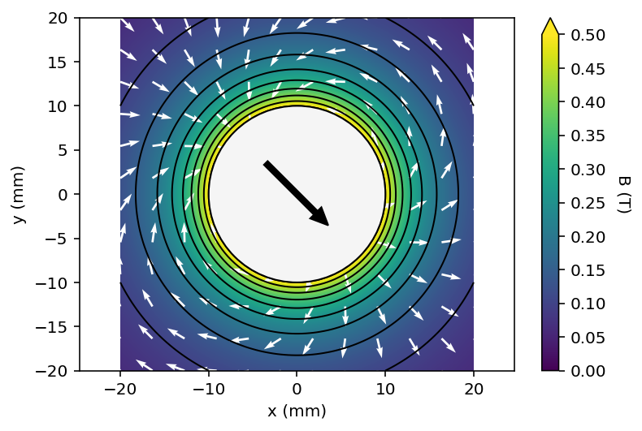

# Pymagnet

User friendly magnetic field calculations in Python

[](https://opensource.org/licenses/MPL-2.0)
[](https://creativecommons.org/licenses/by-sa/4.0/)

## Getting Started

Installing `pymagnet` can be done using

```bash
python -m pip install pymagnet 
```

or

```bash
conda install -c pdunne pymagnet
```

### Examples

Additional examples are in the [examples directory of the repository](https://github.com/pdunne/pymagnet/tree/main/examples).

### 3D calculation and render using plotly

A cylinder of radius 5 mm, length 20 mm, is instantiated and rotated by 30 degrees about the x-axis
by 330 degrees. Two example plots are shown, using surface slices along the three principal axes,
and a volume plot.

```python
import pymagnet as pm
pm.reset_magnets() # clear magnet registry

center = (0, 0, 0)    
radius = 5e-3    
length = 20e-3

# Create a magnet instance
m_cyl = pm.magnets.Cylinder(radius = radius, length = length, Jr = 1.0,
                            center=center,
                            alpha = 0, # rotation of magnet w.r.t. z-axis
                            beta = -30, # rotation of magnet w.r.t. y-axis
                            gamma = 0, # rotation of magnet w.r.t. x-axis
                            )

# Calculate and display 3 slices
# Cache is a dictionary containing all the calculated values
cache = pm.plots.surface_slice3(cmin=0.0, # minimum field value
                                cmax=0.3, # maximum field value
                                opacity=1.0, # opacity of slices
                                num_arrows=10, # number of arrows in vector field
                                cone_opacity=0.9, # opacity of arrows
                                )


# Calculate and display volume plot
# volume_cache is a dictionary containing all the calculated values
volume_cache = pm.plots.volume_plot(cmin=0.0, # minimum field value
                                    cmax=0.3, # maximum field value
                                    opacity=0.1, # needs to be small for visibility
                                    num_levels=6, # number of color levels to be plotted
                                    # number of points in each direction, total number is num_points^3
                                    num_points=50,
                                    )
```
<figure>
  
  
  <figcaption>3D surface slice plot</figcaption>
</figure>

<figure>
  
  
  <figcaption>3D volume plot</figcaption>
</figure>

### 2D calculation and render using matplotlib


<figure>
  
  
  <figcaption>2D contour plot and streamplot of a long bipolar rod</figcaption>
</figure>

Two square magnets of 20x20 mm are added, and a contour plot with a vector field are drawn.

```python
import pymagnet as pm

pm.reset_magnets() # clear magnet registry

cmap = 'viridis' # set the colormap

radius = 10e-3
center = (0, 0)

# Create magnet
_ = pm.magnets.Circle(radius=radius, Jr = 1.0, center=center, alpha=45)


# Prepare 100x100 grid of x,y coordinates to calculate the field
x, y = pm.grid2D(2*radius, 2*radius)

# Calculate the magnetic field due to all magnets in the registry
B = pm.B_calc_2D(x, y)

# Plot the result, vector_plot = True toggles on the vector field plot
pm.plots.plot_2D_contour(x, y, B,
                         cmax=0.5,
                         num_levels=6,
                         cmap=cmap,
                         vector_plot=True,
                         vector_arrows=11)


# Plot the result as a streamplot 
pm.plots.plot_2D_contour(x, y, B,
                         cmin = -0.3,
                         cmax=0.3,
                         cmap='coolwarm',
                         plot_type="streamplot",
                         stream_color= 'vertical', # 'vertical', 'horizontal', 'normal':
                        #  corresponds to coloring by B.x, B.y, B.n
                        )

```

<figure>
  
  <figcaption>2D contour plot</figcaption>
</figure>

```python
import pymagnet as pm
pm.reset_magnets() # clear magnet registry

cmap = 'viridis' # set the colormap

width = 20e-3
height = 20e-3

# Set the space between magnets to be the width of one
half_gap = width / 2 

# Center of first magnet
center = (-width / 2 - half_gap, 0)

# Create first magnet
_ = pm.magnets.Rectangle(width=width, height=height,
                        Jr=1.0, center=center, theta=0.0)

# Centre of second magnet
center = (width / 2 + half_gap, 0)

# Create second magnet
_ = pm.magnets.Rectangle(width=width, height=height,
                        Jr=1.0, center=center, theta=90.0)

# Prepare 100x100 grid of x,y coordinates to calculate the field
x, y = pm.grid2D(2 * width, 2 * height)

# Calculate the magnetic field due to all magnets in the registry
B = pm.B_calc_2D(x, y)

# Plot the result, vector_plot = True toggles on the vector field plot
pm.plots.plot_2D_contour(x, y, B, cmin=0.0, # minimum field value
                                 cmax=0.5, # maximum field value
                                 vector_plot=True, # plot the vector field
                                 cmap=cmap, # set the colormap
                                 )

```

## Calculating Magnetic Fields and Forces

Forms of this library have been used in a number of projects including [Liquid flow and control without solid walls, Nature 2020](https://www.nature.com/articles/s41586-020-2254-4).

## Features

This code uses analytical expressions to calculate the magnetic field due to
simple magnets. These include:

* 3D objects: cubes, cuboids, cylinders, spheres
* 2D: rectangles, squares

There are helper functions to plot the data as either line or countour plots,
but the underlying data is also accessible.

## Prerequisites

Ensure you have [Python](https://www.anaconda.com/) version >= 3.6
 (to use f-strings), and the following packages:

* numpy
* matplotlib
* numba
* plotly

!!! TODO
    - Complete documentation

!!! Warning
    - For spheres, rotate them using alpha, beta, gamma,
    rather than the magnetisation angles theta and phi, as phi rotations are not working correctly.
    - Similarly, for circles, rotate them using alpha, not phi.

## Licensing

Source code licensed under the [Mozilla Public License Version 2.0](https://www.mozilla.org/en-US/MPL/2.0/)

Documentation is licensed under a Creative Commons Attribution-ShareAlike 4.0 International [(CC BY-SA 4.0)](https://creativecommons.org/licenses/by-sa/4.0/) license.

This is a human-readable summary of (and not a substitute for) the license, adapted from [CS50x](https://cs50.harvard.edu/x/2021/license/). Official translations of this license are available in other languages.

**You are free to:**

* **Share** — copy and redistribute the material in any medium or format.
* **Adapt** — remix, transform, and build upon the material.

**Under the following terms:**

* **Attribution** — You must give appropriate credit, provide a link to the license, and indicate if changes were made. You may do so in any reasonable manner, but not in any way that suggests the licensor endorses you or your use.
* **ShareAlike** — If you remix, transform, or build upon the material, you must distribute your contributions under the same license as the original
* No additional restrictions — You may not apply legal terms or technological measures that legally restrict others from doing anything the license permits.

### Contribution

Unless you explicitly state otherwise, any contribution intentionally submitted
for inclusion in the work by you shall be licensed as above, without any
additional terms or conditions.
