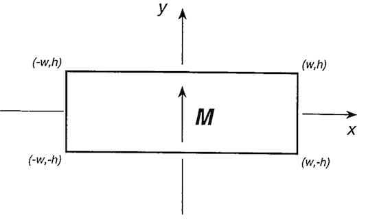

# Composite Magnets

!!! note
    - SI Units with the Sommerfeld convetion are used for this discussion:
    $\mathbf{B} = \mu_0 \left( \mathbf{H} + \mathbf{M}  \right)$[^1]
    - However, the Kennelly Convetion is used for the creation of each magnet object
    in the library:
    $\mathbf{B} = \mu_0\mathbf{H} + \mathbf{J}$[^1]
    - In free space $\mathbf{B} = \mu_0 \mathbf{H}$
    - In magnetised bodies, the demagnetising field $\mathbf{H_d} = - N \mathbf{M}$,
    where $N$ is the demagnetising factor.

## 2D Polygons

### Line Elements

<figure>
    
</figure>

The magnetic field due to an infinitely long, thin magnetic sheet of height $2h$
with a surface current density $\mathbf{K} = K_0 \mathbf{\hat{z}}$ is[^1]

$$
B_x = \frac{\mu_0 K_0}{4\pi} \ln \left( \frac{x^2 + (y-h)^2}{x^2 + (y+h)^2} \right)
$$

and

$$
B_y = \frac{\mu_0 K_0}{2\pi} \tan^{-1} \left( \frac{2hx}{x^2 + y^2 - h^2} \right)
$$

### Composite Polygons

An object consisting of two vertical sheets, one at $-w$ with $\mathbf{K} = -K_0 \mathbf{\hat{z}}$, and one
at $+w$ with with $\mathbf{K} = K_0\mathbf{\hat{z}}$ will produce the same field as a rectangular magnetic of
width $2w$, height $2h$, and remnant magnetisation $\mathbf{J_r} = J_y \mathbf{\hat{y}}$,

The surface current $\mu_0 \mathbf{K}$

$$
\mu_0 \mathbf{K} =  \mathbf{J} \times \mathbf{\hat{n}}  = \left( J_x n_y - J_y n_x  \right)\mathbf{\hat{z}}
$$

where  $\mathbf{\hat{n}} = n_x  \mathbf{\hat{x}}  + n_y  \mathbf{\hat{y}}  + 0  \mathbf{\hat{z}}$
is the unit normal vector to the magnetic sheet, and
$\mathbf{J} = J_x  \mathbf{\hat{x}}  + J_y  \mathbf{\hat{y}}  + 0  \mathbf{\hat{z}}$
is the remnant magnetisation vector of the composite polygonal magnet.

## 3D Polyhedra

For polyhedra composed of right angled triangles, the magnetic field can be calculated as the sum of magnetic fields due to these elements[^3]:

$$
\sigma_m = \mathbf{M} \cdot \mathbf{\hat{n}}
$$

$$
\begin{align}
H_x &= \frac{\sigma_m}{4\pi\mu_0} \left[
  \ln \left( \frac{ r_2 + b - z }{ r_3  - z}\right) +  \frac{b}{c}  \ln \left(   \frac{r - s }{ r_2 + t } \right) \right]
\end{align}
$$

and similarly

$$
\begin{align}
H_z &= \frac{\sigma_m}{4\pi\mu_0} \left[
  \ln \left( \frac{ r - x }{r_3 + a}\right) + \frac{a}{c}  \ln \left(  \frac{ r_2 + t}{r - s } \right) \right]
\end{align}
$$

where

$c = \sqrt{a^2 + b^2}$

$r = \sqrt{x^2 + y^2 + z^2}$

$r_2 = \sqrt{ (a - x)^2 + y^2 + (b - z)^2 }$

$r_3 = \sqrt{(a-x)^2 + y^2 + z^2}$

$s = \frac{ax + bz}{c },\, t = \frac{a (a-x) + b(b-z)}{c}$

 

$$
\begin{align}
H_y = \frac{\sigma_m}{2\pi\mu_0} &\left[
  \tan^{-1}\left(\frac{x-a + z + r_3}{y}\right)\right. - \tan^{-1} \left(\frac{x+z+r}{y} \right) \\
  & + \frac{y}{\alpha D} \left\{ \tan^{-1} \left(\frac{C + (A+B)\left(  \sqrt{1 + \delta^2} + \delta \right)}{D} \right) \right. \\
  &\,\, \left.\left.  -\tan^{-1} \left( \frac{C + (A+B)\left(  \sqrt{1 + \eta^2} + \eta \right)}{D} \right) \right\} \right]
\end{align}
$$

where

$\alpha = \sqrt{1 + \frac{b^2}{a^2}}, \, \beta = - \frac{x + \frac{bz}{a}}{\alpha^2}, \, \gamma = \sqrt{\frac{r^2}{\alpha^2} - \beta^2}$

$\delta = \frac{\alpha + \beta}{\gamma}, \, \eta = \frac{\beta}{\gamma}$

$A = -\gamma \frac{b}{a},\, B = \gamma\alpha,\, C = z + \beta\frac{b}{a}, \, D = \sqrt{B^2 - A^2 - C^2}$

[^1]: J. M. D. Coey, Magnetism and Magnetic Materials (Cambridge University Press, 2010).
[^2]: E. P. Furlani, Permanent Magnet and Electromechanical Devices (Academic Press, San Diego, 2001).
[^3]: J. Hilton, Computational Modelling of Novel Permanent Magnetic Designs, Ph.D. thesis, Trinity College (Dublin, Ireland), School of Physics, (2005).
