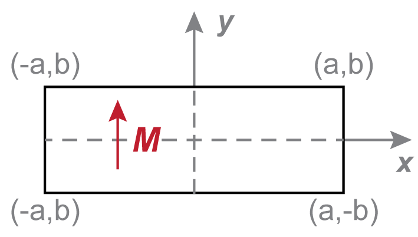
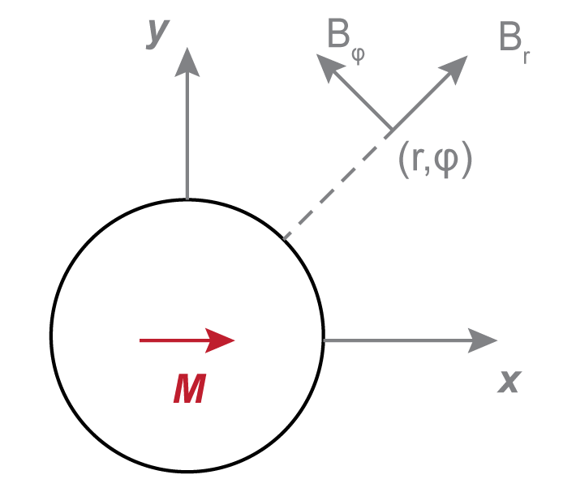

# 2D Magnets

!!! note
    - SI Units with the Sommerfeld convetion are used for this discussion:
    $\mathbf{B} = \mu_0 \left( \mathbf{H} + \mathbf{M}  \right)$[^1]
    - However, the Kennelly Convetion is used for the creation of each magnet object
    in the library:
    $\mathbf{B} = \mu_0\mathbf{H} + \mathbf{J}$[^1]
    - In free space $\mathbf{B} = \mu_0 \mathbf{H}$
    - In magnetised bodies, the demagnetising field $\mathbf{H_d} = - N \mathbf{M}$,
    where $N$ is the demagnetising factor.

For infinitely long objects, the field problems can be approximated in 2D, where the magnet field consists of:

$$
\mathbf{B} = B_x \mathbf{\hat{x}} + B_y\mathbf{\hat{y}}
$$

## Rectangles

<figure>
    
    <figcaption>2D Magnet Rectangle</figcaption>
</figure>

### Magnetised in $y$

The magnetic field due to a rectangle magnetised in $y$ is[^2]:

$$
B_x = \frac{\mu_0 M_r}{4\pi} \left[\ln {\left(
\frac{{\left(x+a\right)}^2 + {\left(y-b\right)}^2}{{\left(x+a\right)}^2
+{\left(y+b\right)}^2}
\right)}
-\ln{\left(
\frac{{\left(x-a\right)}^2+{\left(y-b\right)}^2}{ {\left(x-a\right)}^2 +
{\left(y+b\right)}^2}
\right)}\right]
$$

$$
B_y = \frac{\mu_0 M_r}{2\pi}
\left[{\tan}^{-1}{\left( \frac{2b \left(x+a\right)}{y^2-b^2+{\left(x+a\right)}^2}
\right)}
- {\tan}^{-1}{\left(\frac{2b\left(x-a\right)}{y^2-b^2+{\left(x-a\right)}^2}\right)}\right]
$$

### Magnetised in $x$

The magnetic field due to a rectangle magnetised in $x$ is[^2]:

$$
B_x = \frac{\mu_0 M_r}{2\pi} \left[
{\tan}^{-1}{\left( \frac{2a \left(b+y\right)}{x^2-a^2+{\left(y+b\right)}^2} \right)}
+ {\tan}^{-1}{\left( \frac{2a \left(b-y\right)}{x^2-a^2+{\left(y-b\right)}^2} \right)}
\right]
$$

$$
B_y = -\frac{\mu_0 M_r}{4\pi} \left[
\ln{\left( \frac{{\left(x-a\right)}^2+{\left(y-b\right)}^2}{{\left(x+a\right)}^2+{\left(y-b\right)}^2} \right)}
- \ln{\left( \frac{{\left(x-a\right)}^2+{\left(y+b\right)}^2}{{\left(x+a\right)}^2+{\left(y+b\right)}^2} \right)}
\right]
$$

where $a$ is the half-width and $b$ is the half-height of the rectangle.

---

## Biaxial Rods (Circle)

<figure>
    
</figure>

A long bipolar rod of radius $a$ can be approximated as circular source. The magnetic
stray field is most conveniently written in polar coordinates, as[^2]:

$$
\mathbf{B} = \frac{\mu_0 M_r}{2} \left( \frac{a^2}{r^2}\right) \left[
    \cos(\phi) \mathbf{\hat{r}} + \sin(\phi) \mathbf{\hat{\phi}}
     \right]
$$

In Cartesian coordinates, this becomes:

$$
B_x = \frac{\mu_0 M_r}{2} \left( \frac{a^2}{r^4}\right) \left[
    (x^2 - y^2)\cos(\phi_0) + 2xy\sin(\phi_0)
     \right]
$$

$$
B_y = \frac{\mu_0 M_r}{2} \left( \frac{a^2}{r^4}\right) \left[
    2xy\cos(\phi_0) - (x^2 - y^2)\sin(\phi_0)
     \right]
$$

where $r^2 = x^2 + y^2$ and $\phi_0$ is the magnetisation angle from the x-axis.

---

## Polygon Magnets

For arbitrary 2D polygonal shapes, the magnetic field is calculated using a line element approach. The polygon is decomposed into line segments, and the field contribution from each segment is summed.

For a line segment with surface charge density $\sigma_m = \mathbf{M} \cdot \mathbf{\hat{n}}$, the magnetic field contribution is:

$$
\mathbf{B} = \frac{\mu_0 \sigma_m}{2\pi} \int_{\text{line}} \frac{\mathbf{r}'}{|\mathbf{r}'|^2} \, dl
$$

This integral has an analytical solution for straight line segments, enabling efficient calculation of fields from complex polygonal cross-sections.

[^1]: J. M. D. Coey, Magnetism and Magnetic Materials (Cambridge University Press, 2010).
[^2]: E. P. Furlani, Permanent Magnet and Electromechanical Devices (Academic Press, San Diego, 2001).
