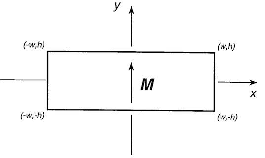
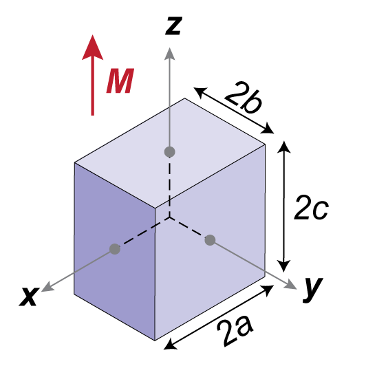
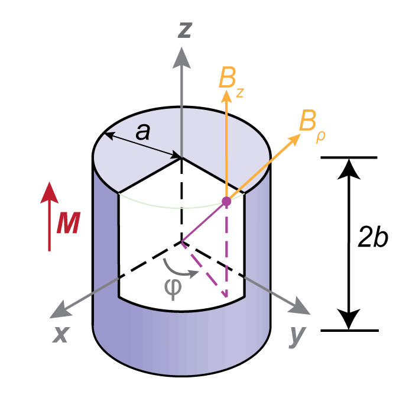
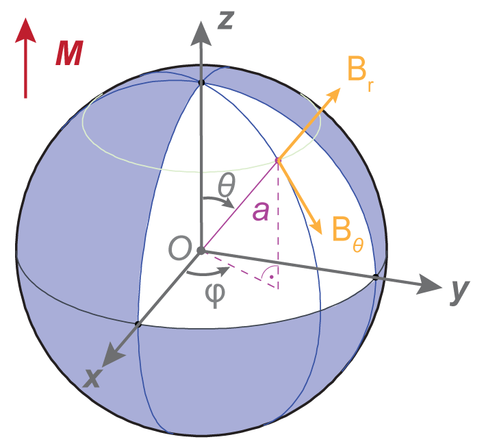

# Magnets Overview

## 2D Magnets

Additional keyword arguments for all `Magnet2D` magnets:

- `phi`: angle in degrees between magnetisation vector and x-axis. Default varies by magnet type (see below).
- `alpha`: rotation angle in degrees. Defaults to 0.
- `center`: 2 element tuple (x,y) corresponding to centre of magnet. Defaults to (0,0).

### Rectangle

<figure>
    
    <figcaption>2D Magnet Rectangle</figcaption>
</figure>

Rectangle 2D magnet class.

**Parameters:**

| Parameter | Type | Default | Description |
|-----------|------|---------|-------------|
| `width` | float | 20.0 | Magnet width |
| `height` | float | 40.0 | Magnet height |
| `Jr` | float | 1.0 | Remnant magnetisation (T) |
| `phi` | float | 90 | Magnetisation angle from x-axis (degrees) |
| `alpha` | float | 0 | Rotation angle (degrees) |
| `center` | tuple | (0, 0) | Centre position (x, y) |

```python
import pymagnet as pm
magnet = pm.magnets.Rectangle(width=10, height=30, Jr=1.0)
print(magnet)
```

### Square

Square 2D magnet class, a subclass of Rectangle.

**Parameters:**

| Parameter | Type | Default | Description |
|-----------|------|---------|-------------|
| `width` | float | 20.0 | Side length |
| `Jr` | float | 1.0 | Remnant magnetisation (T) |
| `phi` | float | 90 | Magnetisation angle from x-axis (degrees) |
| `alpha` | float | 0 | Rotation angle (degrees) |
| `center` | tuple | (0, 0) | Centre position (x, y) |

```python
import pymagnet as pm
magnet = pm.magnets.Square(width=10, Jr=1.0)
print(magnet)
```

## Biaxial Rods (Circle)

<figure>
    
</figure>

Circle 2D magnet class representing a long bipolar rod (infinite length cylinder in 2D).

**Parameters:**

| Parameter | Type | Default | Description |
|-----------|------|---------|-------------|
| `radius` | float | 10.0 | Radius |
| `Jr` | float | 1.0 | Remnant magnetisation (T) |
| `phi` | float | 0 | Magnetisation angle from x-axis (degrees) |
| `center` | tuple | (0, 0) | Centre position (x, y) |

!!! note
    The Circle magnet defaults to `phi=0` (magnetisation along x-axis), unlike Rectangle/Square which default to `phi=90` (magnetisation along y-axis).

```python
import pymagnet as pm
magnet = pm.magnets.Circle(radius=10, Jr=1.0)
print(magnet)
```

### PolyMagnet

<figure>
    
</figure>

PolyMagnet 2D magnet class for arbitrary polygonal cross-sections.

**Parameters:**

| Parameter | Type | Default | Description |
|-----------|------|---------|-------------|
| `custom_polygon` | Polygon | None | Custom polygon object |
| `vertices` | ndarray | None | Array of polygon vertices |
| `num_sides` | int | None | Number of sides for regular polygon |
| `apothem` | float | None | Apothem for regular polygon |
| `length` | float | None | Side length for regular polygon |
| `radius` | float | None | Circumradius for regular polygon |
| `Jr` | float | 1.0 | Remnant magnetisation (T) |
| `phi` | float | 90 | Magnetisation angle from x-axis (degrees) |
| `center` | tuple | (0, 0) | Centre position (x, y) |

```python
import pymagnet as pm

# Using vertices
vertices = [(0, 0), (10, 0), (10, 10), (0, 10)]
magnet = pm.magnets.PolyMagnet(vertices=vertices, Jr=1.0)

# Using regular polygon
magnet = pm.magnets.PolyMagnet(num_sides=6, radius=10, Jr=1.0)
```

---

## 3D Magnets

Additional keyword arguments for all `Magnet3D` magnets:

- `theta`: angle in degrees between magnetisation vector and z-axis. Defaults to 0.
- `phi`: angle in degrees between magnetisation vector projection (in xy-plane) and x-axis. Defaults to 90.
- `alpha`: rotation angle in degrees about z-axis. Defaults to 0.
- `beta`: rotation angle in degrees about y-axis. Defaults to 0.
- `gamma`: rotation angle in degrees about x-axis. Defaults to 0.
- `center`: 3 element tuple (x, y, z) corresponding to centre of magnet. Defaults to (0, 0, 0).
- `mask_magnet`: if True, field inside magnet is set to NaN. Defaults to False.

### Prism

<figure>
    
</figure>

Cuboidal (rectangular prism) 3D magnet class.

**Parameters:**

| Parameter | Type | Default | Description |
|-----------|------|---------|-------------|
| `width` | float | 10.0 | Width (x-direction) |
| `depth` | float | 10.0 | Depth (y-direction) |
| `height` | float | 10.0 | Height (z-direction) |
| `Jr` | float | 1.0 | Remnant magnetisation (T) |
| `theta` | float | 0 | Magnetisation polar angle (degrees) |
| `phi` | float | 90 | Magnetisation azimuthal angle (degrees) |
| `alpha`, `beta`, `gamma` | float | 0 | Rotation angles (degrees) |
| `center` | tuple | (0, 0, 0) | Centre position (x, y, z) |
| `mask_magnet` | bool | False | Mask field inside magnet |

```python
import pymagnet as pm
magnet = pm.magnets.Prism(width=10, depth=20, height=30, Jr=1.0)
print(magnet)
```

### Cube

Cube 3D magnet class, a subclass of Prism with equal dimensions.

**Parameters:**

| Parameter | Type | Default | Description |
|-----------|------|---------|-------------|
| `width` | float | 10.0 | Side length |
| `Jr` | float | 1.0 | Remnant magnetisation (T) |
| `theta` | float | 0 | Magnetisation polar angle (degrees) |
| `phi` | float | 90 | Magnetisation azimuthal angle (degrees) |
| `alpha`, `beta`, `gamma` | float | 0 | Rotation angles (degrees) |
| `center` | tuple | (0, 0, 0) | Centre position (x, y, z) |
| `mask_magnet` | bool | False | Mask field inside magnet |

```python
import pymagnet as pm
magnet = pm.magnets.Cube(width=10, Jr=1.0)
print(magnet)
```

### Cylinder

<figure>
    
</figure>

Cylindrical 3D magnet class with axis along z-direction.

**Parameters:**

| Parameter | Type | Default | Description |
|-----------|------|---------|-------------|
| `radius` | float | 5.0 | Cylinder radius |
| `length` | float | 10.0 | Cylinder length (along z) |
| `Jr` | float | 1.0 | Remnant magnetisation (T) |
| `theta` | float | 0 | Magnetisation polar angle (degrees) |
| `phi` | float | 90 | Magnetisation azimuthal angle (degrees) |
| `alpha`, `beta`, `gamma` | float | 0 | Rotation angles (degrees) |
| `center` | tuple | (0, 0, 0) | Centre position (x, y, z) |
| `mask_magnet` | bool | False | Mask field inside magnet |

```python
import pymagnet as pm
magnet = pm.magnets.Cylinder(radius=10, length=10, Jr=1.0)
print(magnet)
```

### Sphere

<figure>
    
</figure>

Spherical 3D magnet class.

**Parameters:**

| Parameter | Type | Default | Description |
|-----------|------|---------|-------------|
| `radius` | float | 5.0 | Sphere radius |
| `Jr` | float | 1.0 | Remnant magnetisation (T) |
| `alpha`, `beta`, `gamma` | float | 0 | Rotation angles (degrees) |
| `center` | tuple | (0, 0, 0) | Centre position (x, y, z) |
| `mask_magnet` | bool | False | Mask field inside magnet |

```python
import pymagnet as pm
magnet = pm.magnets.Sphere(radius=10, Jr=1.0)
print(magnet)
```

!!! warning
    `phi` and `theta` do not apply to spheres. The magnetisation is always along the z-axis before rotation. To rotate the magnetisation of a sphere, use the rotation angles `alpha`, `beta`, `gamma`.

### Mesh

3D magnet defined by an STL mesh file. Useful for complex non-convex geometries.

**Parameters:**

| Parameter | Type | Default | Description |
|-----------|------|---------|-------------|
| `filename` | str | required | Path to STL file |
| `Jr` | float | 1.0 | Remnant magnetisation (T) |
| `mesh_scale` | float | 1.0 | Scaling factor for mesh coordinates |
| `theta` | float | 0 | Magnetisation polar angle (degrees) |
| `phi` | float | 90 | Magnetisation azimuthal angle (degrees) |
| `alpha`, `beta`, `gamma` | float | 0 | Rotation angles (degrees) |
| `center` | tuple | (0, 0, 0) | Centre position (x, y, z) |

```python
import pymagnet as pm
magnet = pm.magnets.Mesh("path/to/model.stl", Jr=1.0, mesh_scale=0.001)
print(magnet)
```

!!! note
    The rotation angles `alpha`, `beta`, `gamma` rotate the mesh vertices but not the magnetisation direction. Use `theta` and `phi` to set the magnetisation direction.

---

## Managing Magnets

### Reset All Magnets

Clear all instantiated magnets from the registry:

```python
import pymagnet as pm
pm.reset_magnets()
```

### List All Magnets

Print all currently instantiated magnets:

```python
import pymagnet as pm
pm.magnets.Prism(Jr=1.0)
pm.magnets.Cylinder(Jr=0.5)
pm.list_magnets()
```
