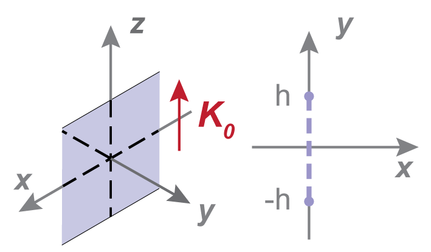

# Magnets Overview

## 2D Magnets

Additional keyword arguments for all `Magnet2D` magnets:

- phi: angle in degrees between magnetisation vector and x-axis. Defaults to 90.
- alpha: rotation angle in degrees. Defaults to 0.
- center: 2 element tuple (x,y) corresponding to centre of magnet. Defaults to (0,0).

### Rectangle

<figure>
    
    <figcaption>2D Magnet Rectangle</figcaption>
</figure>

Rectangle 2D magnet class

```python
import pymagnet as pm
magnet = pm.magnets.Rectangle(width = 10, height = 30, Jr = 1.0)
print(magnet)
```

Jr: remnant magnetisation in T. Defaults to 1.0.

### Square

Square 2D magnet class, a subclass of Rectangle

```python
import pymagnet as pm
magnet = pm.magnets.Square(width = 10, Jr = 1.0)
print(magnet)
```

## Biaxial Rods (Circle)

<figure>
    
</figure>

Circle 2D magnet class

```python
import pymagnet as pm
magnet = pm.magnets.Circle(radius = 10, Jr = 1.0)
print(magnet)
```

### PolyMagnet

<figure>
    
</figure>

PolyMagnet 2D magnet class

## 3D Magnets

Additional keyword arguments for all `Magnet3D` magnets:

- theta: angle in degrees between magnetisation vector and z-axis. Defaults to 0.
- phi: angle in degrees between magnetisation vector and x-axis. Defaults to .
- alpha: rotation angle in degrees about z-axis. Defaults to 0.
- beta: rotation angle in degrees about y-axis. Defaults to 0.
- gamma: rotation angle in degrees about x-axis. Defaults to 0.
- center: 3 element tuple (x,y, z) corresponding to centre of magnet. Defaults to (0,0,0).

### Prism

<figure>
    
</figure>

```python
import pymagnet as pm
magnet = pm.magnets.Prism(width = 10, depth = 20, height = 30, Jr = 1.0)
print(magnet)
```

### Cube

```python
import pymagnet as pm
magnet = pm.magnets.Cube(width = 10, Jr = 1.0)
print(magnet)
```

### Cylinder

<figure>
    
</figure>

```python
import pymagnet as pm
magnet = pm.magnets.Cylinder(radius = 10, length = 10, Jr = 1.0)
print(magnet)
```

### Sphere

<figure>
    
</figure>

```python
import pymagnet as pm
magnet = pm.magnets.Sphere(radius = 10, Jr = 1.0)
print(magnet)
```

!!! note
    `phi`, `theta` do not apply to spheres, to rotate the magnetisation of a sphere, use the rotation angles
    `alpha`, `beta`, `gamma`

### Mesh

```python
import pymagnet as pm
magnet = pm.magnets.Mesh(filename, Jr = 1.0)
print(magnet)
```

!!! note
    The rotation angles `alpha`, `beta`, `gamma` only rotate the mesh vertices, but not the magnetisation.
