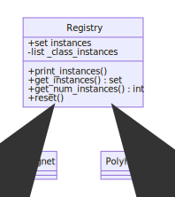
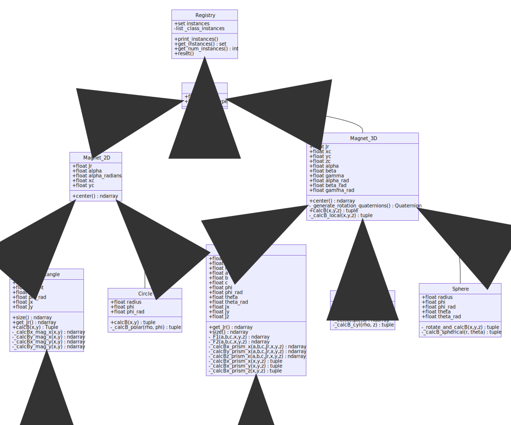

# Methods

!!! TODO
    - Complete all methods documentation

The overall approach is to

1. Instantiate a set of magnets
2. Generate an array of points to be calcuated
3. Loop over each magnet, calcuate the field at each point and sum this to the
total field.
4. Draw the resulting data as a line, contour, slice, or volume plot.

## Classes

At the top of the hierarchy is the Registry class which records a set of `Weakref`
references to instances of each class, which is used for the `Magnet` and `Polyhedron`
child classes.

### Magnet Classes

The hierarcy of magnet classes is (click image for high resolution view)
<!--  -->

[](https://mermaid-js.github.io/mermaid-live-editor/#/edit/eyJjb2RlIjoiY2xhc3NEaWFncmFtXG4gICAgUmVnaXN0cnkgPHwtLSBNYWduZXRcbiAgICBNYWduZXQgPHwtLSBNYWduZXRfMkRcbiAgICBNYWduZXRfMkQgPHwtLSBSZWN0YW5nbGVcbiAgICBSZWN0YW5nbGUgPHwtLSBTcXVhcmVcbiAgICBNYWduZXRfMkQgPHwtLSBDaXJjbGVcbiAgICBNYWduZXQgPHwtLSBNYWduZXRfM0RcbiAgICBNYWduZXRfM0QgPHwtLSBQcmlzbVxuICAgIFByaXNtIDx8LS0gQ3ViZVxuICAgIE1hZ25ldF8zRCA8fC0tIEN5bGluZGVyXG4gICAgTWFnbmV0XzNEIDx8LS0gU3BoZXJlXG4gICAgY2xhc3MgUmVnaXN0cnl7XG4gICAgICAgICtzZXQgaW5zdGFuY2VzXG4gICAgICAgIC1saXN0IF9jbGFzc19pbnN0YW5jZXNcbiAgICAgICAgK3ByaW50X2luc3RhbmNlcygpXG4gICAgICAgICtnZXRfaW5zdGFuY2VzKCkgc2V0XG4gICAgICAgICtnZXRfbnVtX2luc3RhbmNlcygpIGludFxuICAgICAgICArcmVzZXQoKVxuICAgIH1cbiAgICBjbGFzcyBNYWduZXR7XG4gICAgICAgICtmbG9hdCB0b2xcbiAgICAgICAgK1N0cmluZyBtYWdfdHlwZVxuICAgIH1cbiAgICBjbGFzcyBNYWduZXRfMkR7XG4gICAgICAgICtmbG9hdCBKclxuICAgICAgICArZmxvYXQgYWxwaGFcbiAgICAgICAgK2Zsb2F0IGFscGhhX3JhZGlhbnNcbiAgICAgICAgK2Zsb2F0IHhjXG4gICAgICAgICtmbG9hdCB5Y1xuICAgICAgICArY2VudGVyKCkgbmRhcnJheVxuICAgIH1cbiAgICBjbGFzcyBSZWN0YW5nbGV7XG4gICAgICAgICtmbG9hdCB3aWR0aFxuICAgICAgICArZmxvYXQgaGVpZ2h0XG4gICAgICAgICtmbG9hdCBwaGlcbiAgICAgICAgK2Zsb2F0IHBoaV9yYWRcbiAgICAgICAgK2Zsb2F0IEp4XG4gICAgICAgICtmbG9hdCBKeVxuICAgICAgICArc2l6ZSgpIG5kYXJyYXlcbiAgICAgICAgK2dldF9KcigpIG5kYXJyYXlcbiAgICAgICAgK2NhbGNCKHgseSkgVHVwbGVcbiAgICAgICAgLV9jYWxjQnhfbWFnX3goeCx5KSBuZGFycmF5XG4gICAgICAgIC1fY2FsY0J5X21hZ194KHgseSkgbmRhcnJheVxuICAgICAgICAtX2NhbGNCeF9tYWdfeSh4LHkpIG5kYXJyYXlcbiAgICAgICAgLV9jYWxjQnlfbWFnX3koeCx5KSBuZGFycmF5XG5cbiAgICB9XG4gICAgY2xhc3MgQ2lyY2xle1xuICAgICAgICArZmxvYXQgcmFkaXVzXG4gICAgICAgICtmbG9hdCBwaGlcbiAgICAgICAgK2Zsb2F0IHBoaV9yYWRcbiAgICAgICAgK2NhbGNCKHgseSkgdHVwbGVcbiAgICAgICAgLV9jYWxjQl9wb2xhcihyaG8sIHBoaSkgdHVwbGVcbiAgICB9XG4gICAgY2xhc3MgTWFnbmV0XzNEe1xuICAgICAgICArZmxvYXQgSnJcbiAgICAgICAgK2Zsb2F0IHhjXG4gICAgICAgICtmbG9hdCB5Y1xuICAgICAgICArZmxvYXQgemNcbiAgICAgICAgK2Zsb2F0IGFscGhhXG4gICAgICAgICtmbG9hdCBiZXRhXG4gICAgICAgICtmbG9hdCBnYW1tYVxuICAgICAgICArZmxvYXQgYWxwaGFfcmFkXG4gICAgICAgICtmbG9hdCBiZXRhX3JhZFxuICAgICAgICArZmxvYXQgZ2FtbWFfcmFkXG4gICAgICAgICtjZW50ZXIoKSBuZGFycmF5XG4gICAgICAgIC1fZ2VuZXJhdGVfcm90YXRpb25fcXVhdGVybmlvbnMoKSBRdWF0ZXJuaW9uXG4gICAgICAgICtjYWxjQih4LHkseikgdHVwbGVcbiAgICAgICAgLV9jYWxjQl9sb2NhbCh4LHkseikgdHVwbGVcbiAgICB9XG4gICAgY2xhc3MgUHJpc217XG4gICAgICAgICtmbG9hdCB3aWR0aFxuICAgICAgICArZmxvYXQgZGVwdGhcbiAgICAgICAgK2Zsb2F0IGhlaWdodFxuICAgICAgICArZmxvYXQgYVxuICAgICAgICArZmxvYXQgYlxuICAgICAgICArZmxvYXQgY1xuICAgICAgICArZmxvYXQgcGhpXG4gICAgICAgICtmbG9hdCBwaGlfcmFkXG4gICAgICAgICtmbG9hdCB0aGV0YVxuICAgICAgICArZmxvYXQgdGhldGFfcmFkXG4gICAgICAgICtmbG9hdCBKeFxuICAgICAgICArZmxvYXQgSnlcbiAgICAgICAgK2Zsb2F0IEp6XG4gICAgICAgICtnZXRfSnIoKSBuZGFycmF5XG4gICAgICAgICtzaXplKCkgbmRhcnJheVxuICAgICAgICAtX0YxKGEsYixjLHgseSx6KSBuZGFycmF5XG4gICAgICAgIC1fRjIoYSxiLGMseCx5LHopIG5kYXJyYXlcbiAgICAgICAgLV9jYWxjQnhfcHJpc21feChhLGIsYyxKcix4LHkseikgbmRhcnJheVxuICAgICAgICAtX2NhbGNCeV9wcmlzbV94KGEsYixjLEpyLHgseSx6KSBuZGFycmF5XG4gICAgICAgIC1fY2FsY0J6X3ByaXNtX3goYSxiLGMsSnIseCx5LHopIG5kYXJyYXlcbiAgICAgICAgLV9jYWxjQnhfcHJpc21feCh4LHkseikgdHVwbGVcbiAgICAgICAgLV9jYWxjQnhfcHJpc21feSh4LHkseikgdHVwbGVcbiAgICAgICAgLV9jYWxjQnhfcHJpc21feih4LHkseikgdHVwbGVcbiAgICB9XG4gICAgY2xhc3MgQ3lsaW5kZXJ7XG4gICAgICAgICtmbG9hdCByYWRpdXNcbiAgICAgICAgK2Zsb2F0IGxlbmd0aFxuICAgICAgICAtX2NlbChrYyxwLGMscykgbmRhcnJheVxuICAgICAgICAtX2NhbGNCX2N5bChyaG8sIHopIHR1cGxlXG4gICAgfVxuICAgIGNsYXNzIFNwaGVyZXtcbiAgICAgICAgK2Zsb2F0IHJhZGl1c1xuICAgICAgICArZmxvYXQgcGhpXG4gICAgICAgICtmbG9hdCBwaGlfcmFkXG4gICAgICAgICtmbG9hdCB0aGV0YVxuICAgICAgICArZmxvYXQgdGhldGFfcmFkXG4gICAgICAgIC1fcm90YXRlX2FuZF9jYWxjQih4LHkseikgdHVwbGVcbiAgICAgICAgLV9jYWxjQl9zcGhlcmljYWwociwgdGhldGEpIHR1cGxlXG4gICAgfSIsIm1lcm1haWQiOnsidGhlbWUiOiJkZWZhdWx0In0sInVwZGF0ZUVkaXRvciI6ZmFsc2V9)

### Quaternion Class

This is a convenience class for performing rotations of points/vectors about arbitrary axes.

## Plot Methods

### Draw Magnets on Plot

