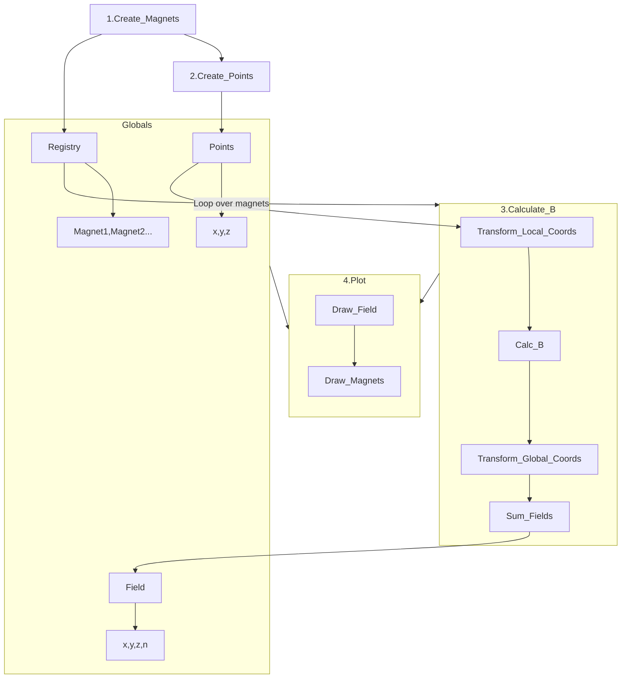
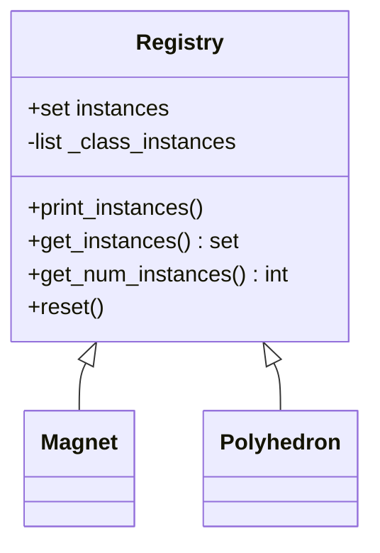
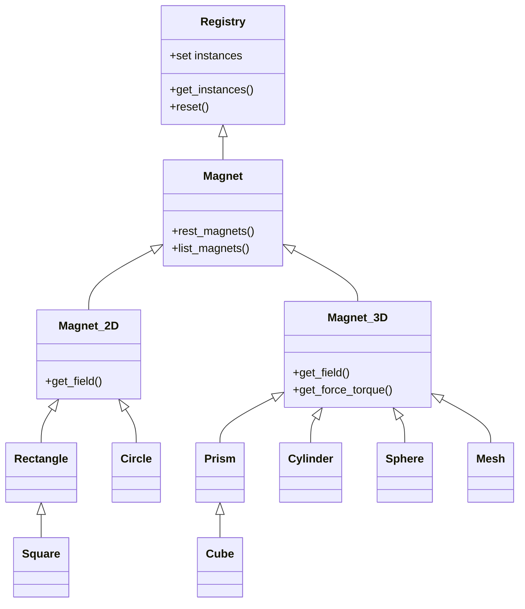

# Methods

## Magnetic Fields

The overall approach is to

1. Instantiate a set of magnets
2. Generate an array of points to be calculated
3. Loop over each magnet, calcuate the field at each point and sum this to the
total field.
4. Draw the resulting data as a line, contour, slice, or volume plot.

## Forces and Torques

1. Find the faces of a magnet with $|\mathbf{M}\cdot \mathbf{\hat{n}}| > 0$

2. Generate a grid of points on each of those faces

3. Calculate the magnetic field at these points due to all other magnets

4. Calculate the mean force and torque on each face

5. Sum the forces and torques on each face

## Classes

At the top of the hierarchy is the Registry class which records a set of `Weakref`
references to instances of each class, which is used for the `Magnet` and `Polyhedron`
child classes.

### Magnet Classes

### Mesh Class

The Mesh magnet class performs

### Quaternion Class

This is a convenience class for performing rotations of points/vectors about arbitrary axes.

## Plot Methods

### Draw Magnets on Plot
