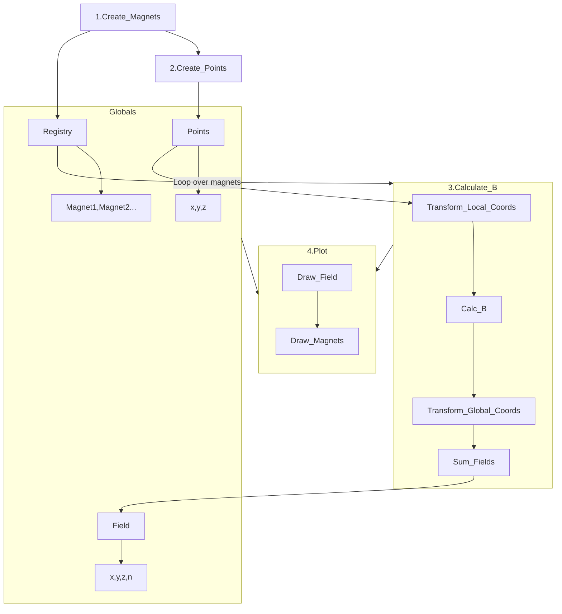
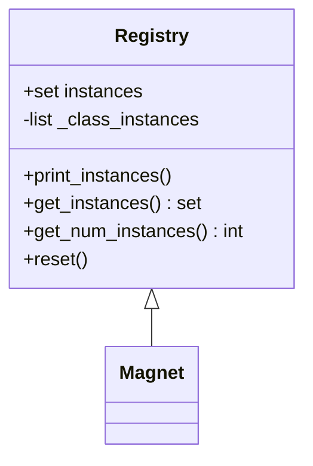
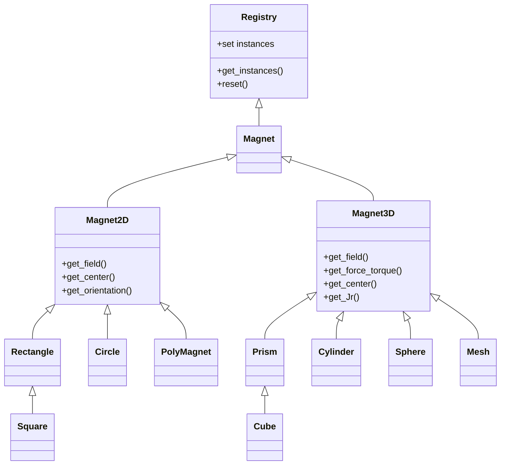
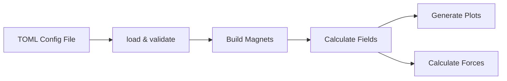

# Methods

## Magnetic Fields

The overall approach is to

1. Instantiate a set of magnets
2. Generate an array of points to be calculated
3. Loop over each magnet, calculate the field at each point and sum this to the
total field.
4. Draw the resulting data as a line, contour, slice, or volume plot.

Alternatively, you can use the [TOML configuration system](../configuration.md) to define all of these steps declaratively in a config file.


```mermaid
flowchart
    1.Create_Magnets-->2.Create_Points
    subgraph 3.Calculate_B
        direction TB
        Transform_Local_Coords -->
        Calc_B -->
        Transform_Global_Coords -->
        Sum_Fields
    end
    subgraph Globals
        direction TB
        Registry --> Magnet1,Magnet2...
        Points --> x,y,z
        Field --> x,y,z,n
    end
    subgraph 4.Plot
        direction TB
        Draw_Field --> Draw_Magnets
    end
    1.Create_Magnets -->Registry
    2.Create_Points -->Points
    Registry -->|Loop over magnets| 3.Calculate_B
    Sum_Fields -->Field
    Points --> Transform_Local_Coords
    3.Calculate_B --> 4.Plot
    Globals --> 4.Plot
```

## Forces and Torques

1. Find the faces of a magnet with $|\mathbf{M}\cdot \mathbf{\hat{n}}| > 0$

2. Generate a grid of points on each of those faces

3. Calculate the magnetic field at these points due to all other magnets

4. Calculate the mean force and torque on each face

5. Sum the forces and torques on each face

## Classes

At the top of the hierarchy is the Registry class which records a set of `Weakref`
references to instances of each class, which is used for the `Magnet` child classes.


```mermaid
classDiagram
Registry <|-- Magnet
class Registry{
    +set instances
    -list _class_instances
    +print_instances()
    +get_instances() set
    +get_num_instances() int
    +reset()
}
```

### Magnet Classes


```mermaid
classDiagram
    Registry <|-- Magnet
    Magnet <|-- Magnet2D
    Magnet2D <|-- Rectangle
    Rectangle <|-- Square
    Magnet2D <|-- Circle
    Magnet2D <|-- PolyMagnet
    Magnet <|-- Magnet3D
    Magnet3D <|-- Prism
    Prism <|-- Cube
    Magnet3D <|-- Cylinder
    Magnet3D <|-- Sphere
    Magnet3D <|-- Mesh
    class Registry{
        +set instances
        +get_instances()
        +reset()
    }
    class Magnet{
    }
    class Magnet2D{
        +get_field()
        +get_center()
        +get_orientation()
    }

    class Rectangle{
    }

    class Circle{
    }
    class PolyMagnet{
    }
    class Magnet3D{
        +get_field()
        +get_force_torque()
        +get_center()
        +get_Jr()
    }
    class Prism{
    }
    class Cylinder{
    }
    class Sphere{
    }
    class Mesh{
    }
```

### Mesh Class

The Mesh magnet class loads geometry from STL files and calculates magnetic fields using a surface charge approach. Each triangular face of the mesh contributes to the total field based on:

- Face normal vector and magnetisation alignment
- Surface charge density $\sigma_m = \mathbf{M} \cdot \mathbf{\hat{n}}$
- Numerical integration over the mesh surface

Field calculations for mesh magnets are parallelised using Numba's `prange`, achieving up to **247x speedup** on multi-core systems. For force and torque calculations, the mesh is subdivided into smaller triangles for improved accuracy.

### Quaternion Class

This is a convenience class for performing rotations of points/vectors about arbitrary axes. Quaternions avoid gimbal lock issues that can occur with Euler angles.

**Key methods:**

| Method | Description |
|--------|-------------|
| `gen_rotation_quaternion(alpha, beta, gamma)` | Create quaternion from Euler angles |
| `get_conjugate()` | Return conjugate quaternion (for inverse rotation) |
| `__mul__` | Rotate a point/vector using quaternion multiplication |

**Example:**

```python
from pymagnet.utils import Quaternion
import numpy as np

# Create rotation quaternion (30° about z, 45° about y, 0° about x)
q = Quaternion.gen_rotation_quaternion(
    np.deg2rad(30), np.deg2rad(45), np.deg2rad(0)
)

# Rotate a point
point = np.array([1, 0, 0])
rotated = q * point
```

---

## Plot Methods

### 2D Plotting (matplotlib)

Functions for 2D visualisation using matplotlib:

| Function | Description |
|----------|-------------|
| `plot_1D_field()` | Line plot of field along magnet axis |
| `plot_2D_line()` | Line plot along arbitrary path |
| `plot_2D_contour()` | Contour plot of field magnitude |
| `plot_3D_contour()` | 3D surface plot using matplotlib |
| `plot_sub_contour_3D()` | Multiple 3D contour subplots |

### 3D Plotting (plotly)

Functions for interactive 3D visualisation using plotly:

| Function | Description |
|----------|-------------|
| `plot_magnet()` | Render 3D magnet geometry |
| `slice_plot()` | Plot field on 2D slice planes |
| `slice_quickplot()` | Quick slice plot with auto grid |
| `volume_plot()` | 3D volume rendering of field |
| `volume_quickplot()` | Quick volume plot with auto grid |

### Draw Magnets on Plot

For 2D plots, magnets are drawn as patches (rectangles, circles, or polygons) overlaid on the field contours.

For 3D plots, magnets are rendered as meshes using plotly's `Mesh3d` graphics object. The rendering classes (`Graphic_Cuboid`, `Graphic_Cylinder`, `Graphic_Sphere`, `Graphic_Mesh`) generate the appropriate vertex data for each magnet type.

---

## Utility Functions

### Field Calculation

| Function | Description |
|----------|-------------|
| `get_field_2D(points)` | Calculate 2D field at given points |
| `get_field_3D(points)` | Calculate 3D field at given points |

### Grid Generation

| Function | Description |
|----------|-------------|
| `grid3D(xmax, ymax, zmax, ...)` | Generate 3D grid of points |
| `slice3D(plane, ...)` | Generate 2D slice in 3D space |
| `line3D(start, end, ...)` | Generate points along a line |

### Magnet Management

| Function | Description |
|----------|-------------|
| `reset_magnets()` | Clear all instantiated magnets |
| `list_magnets()` | Print all current magnets |

---

## Configuration-Based Workflow

As an alternative to the Python API, pymagnet supports a TOML-based declarative workflow:


```mermaid
flowchart LR
    TOML[TOML Config File] --> Load[load & validate]
    Load --> Build[Build Magnets]
    Build --> Calc[Calculate Fields]
    Calc --> Plot[Generate Plots]
    Calc --> Force[Calculate Forces]
```

1. Define magnets, grids, plots, and force settings in a `.toml` file
2. Run via CLI (`pymagnet config.toml`) or Python (`pymagnet.config.run("config.toml")`)
3. Results include field data, plotly/matplotlib figures, and force/torque vectors

See the [Configuration](../configuration.md) page for full documentation.
