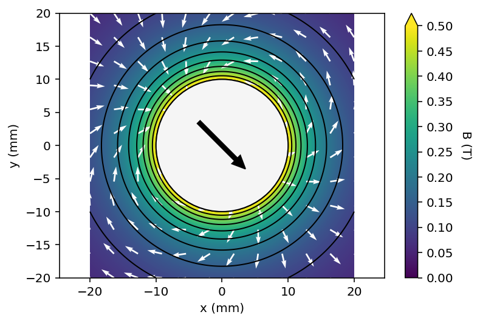
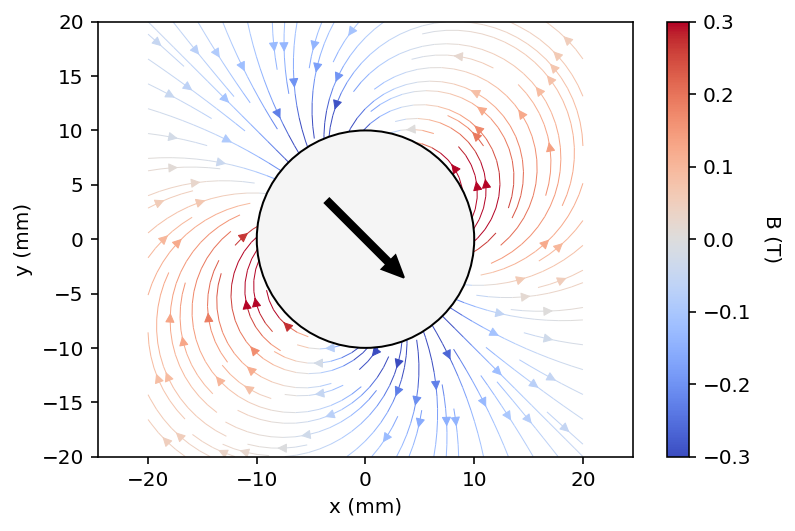

# 2D Plotting

All 2D plotting functions use **matplotlib** as the backend. These functions are suitable for
visualizing magnetic fields from both 2D and 3D magnetic sources.

## Line Plots

### `plot_1D_field`

Calculates and plots the magnetic field along the central symmetry axis of a cylinder or
prism magnet. This is useful for visualizing the axial field profile.

```python
import pymagnet as pm

# Create a cylindrical magnet
magnet = pm.magnets.Cylinder(radius=5, length=10, Jr=1.0)

# Plot the axial field
pm.plots.plot_1D_field(magnet, unit="mm")

# Get the data for further analysis
points, field = pm.plots.plot_1D_field(magnet, unit="mm", return_data=True)
```

**Parameters:**

| Parameter | Type | Default | Description |
|-----------|------|---------|-------------|
| `magnet` | Cylinder \| Prism | required | 3D magnet instance |
| `unit` | str | `"mm"` | Length unit for coordinates |
| `num_points` | int | `101` | Number of sample points along axis |
| `return_data` | bool | `False` | If True, returns (points, field) tuple |

**Returns:** `tuple[Point_Array1, Field1] | None` - Point and field data if `return_data=True`

!!! note
    The plot shows vertical dashed lines indicating the magnet boundaries (blue and red)
    and the origin (black).

---

### `plot_2D_line`

Creates a line plot showing all field components ($|B|$, $B_x$, $B_y$) along a line for 2D
magnetic sources.

```python
import pymagnet as pm
import numpy as np

# Create a 2D magnet and calculate field
magnet = pm.magnets.Rectangle(width=10, height=20, Jr=1.0)
x = np.linspace(-30, 30, 101)
y = np.zeros_like(x) + 25  # Line at y=25
points, field = pm.utils.get_field_2D(x, y)

# Plot
fig, ax = pm.plots.plot_2D_line(points, field)
```

**Parameters:**

| Parameter | Type | Default | Description |
|-----------|------|---------|-------------|
| `point_array` | Point_Array2 | required | Coordinate array from field calculation |
| `field` | Field2 | required | Magnetic field vector |
| `xlab` | str | auto | X-axis label |
| `ylab` | str | auto | Y-axis label |
| `save_fig` | bool | `False` | Save plot to `line_plot.png` |

**Returns:** `tuple[Figure, Axes]` - matplotlib figure and axes objects

---

## Contour Plots

### `plot_2D_contour`

Creates contour plots or streamplots for 2D magnetic field data. Supports visualization
of field magnitude or individual components.

<figure>
    
    
    <figcaption>Contour plot (left) and streamplot (right) of a circular magnet</figcaption>
</figure>

```python
import pymagnet as pm

# Create magnets
magnet = pm.magnets.Circle(radius=10, Jr=1.0)

# Calculate field on a grid
points, field = pm.utils.get_field_2D_grid(
    xmax=30, ymax=30, num_points=101
)

# Contour plot
fig, ax = pm.plots.plot_2D_contour(points, field, cmax=0.5)

# Streamplot
fig, ax = pm.plots.plot_2D_contour(
    points, field,
    plot_type="streamplot",
    cmap="viridis"
)
```

**Parameters:**

| Parameter | Type | Default | Description |
|-----------|------|---------|-------------|
| `point_array` | Point_Array2 | required | 2D coordinate grid |
| `field` | Field2 | required | Magnetic field data |
| `plot_type` | str | `"contour"` | `"contour"` or `"streamplot"` |
| `field_component` | str | `"n"` | Component to plot: `"n"`, `"x"`, or `"y"` |
| `show_magnets` | bool | `True` | Draw magnet outlines |
| `cmap` | str | `"viridis"` | Colormap name |
| `cmin` | float | `0.0` | Color scale minimum |
| `cmax` | float | auto | Color scale maximum |
| `num_levels` | int | `11` | Number of contour levels |
| `num_arrows` | int \| None | `None` | Number of quiver arrows per axis |
| `vector_color` | str | `"w"` | Arrow color |
| `save_fig` | bool | `False` | Save to `contour_plot.png` |

**Returns:** `tuple[Figure, Axes]` - matplotlib figure and axes objects

!!! note
    For streamplots with coloring, pass a `cmap` and optionally set `stream_shading`
    to `"normal"`, `"horizontal"`, or `"vertical"`.

---

### `plot_3D_contour`

Creates a 2D contour plot of a slice through a 3D magnetic field calculation. Useful for
visualizing field distributions in specific planes.

```python
import pymagnet as pm

# Create 3D magnet
magnet = pm.magnets.Prism(width=10, depth=10, height=20, Jr=1.0)

# Calculate field on a slice
points = pm.utils.slice3D(plane="xz", max1=30, max2=30, num_points=101)
field = pm.utils.get_field_3D(points)

# Plot the slice
fig, ax = pm.plots.plot_3D_contour(points, field, plane="xz", cmax=0.5)
```

**Parameters:**

| Parameter | Type | Default | Description |
|-----------|------|---------|-------------|
| `points` | Point_Array2 \| Point_Array3 | required | Coordinate array |
| `field` | Field2 \| Field3 | required | Magnetic field data |
| `plane` | str | required | Plane identifier: `"xy"`, `"xz"`, or `"yz"` |
| `plot_type` | str | `"contour"` | `"contour"` or `"streamplot"` |
| `cmap` | str | `"viridis"` | Colormap name |
| `cmin` | float | `0` | Color scale minimum |
| `cmax` | float | auto | Color scale maximum |
| `num_levels` | int | `11` | Number of contour levels |
| `num_arrows` | int \| None | `None` | Number of quiver arrows |
| `save_fig` | bool | `False` | Save to `contour_plot.png` |

**Returns:** `tuple[Figure, Axes]` - matplotlib figure and axes objects

---

### `plot_sub_contour_3D`

Low-level function for plotting a single field component as a contour plot. Useful for
custom visualizations or comparing different field components.

```python
import pymagnet as pm

# Create magnet and calculate field
magnet = pm.magnets.Prism(width=10, depth=10, height=20, Jr=1.0)
points = pm.utils.slice3D(plane="xz", max1=30, max2=30, num_points=101)
field = pm.utils.get_field_3D(points)

# Plot Bz component
fig, ax = pm.plots.plot_sub_contour_3D(
    points.x, points.z, field.z,
    cmin=-0.5, cmax=0.5,
    cmap="seismic",
    clab=r"$B_z$ (T)"
)
```

**Parameters:**

| Parameter | Type | Default | Description |
|-----------|------|---------|-------------|
| `plot_x` | ndarray | required | X-coordinates for plot |
| `plot_y` | ndarray | required | Y-coordinates for plot |
| `plot_B` | ndarray | required | Field component to plot |
| `cmap` | str | `"seismic"` | Colormap name |
| `xlab` | str | `"x (m)"` | X-axis label |
| `ylab` | str | `"y (m)"` | Y-axis label |
| `clab` | str | `"B (T)"` | Colorbar label |
| `cmin` | float | `-0.5` | Color scale minimum |
| `cmax` | float | `0.5` | Color scale maximum |
| `num_levels` | int | `11` | Number of contour levels |

**Returns:** `tuple[Figure, Axes]` - matplotlib figure and axes objects

---

## Common Options

### Colormaps

Any matplotlib colormap can be used. Common choices:

- `"viridis"` - Default, perceptually uniform
- `"plasma"` - High contrast
- `"seismic"` - Diverging (good for signed components)
- `"coolwarm"` - Diverging alternative

### Saving Figures

All plot functions support `save_fig=True` to save the output. For more control,
use the returned figure object:

```python
fig, ax = pm.plots.plot_2D_contour(points, field)
fig.savefig("my_plot.png", dpi=300, bbox_inches="tight")
```
