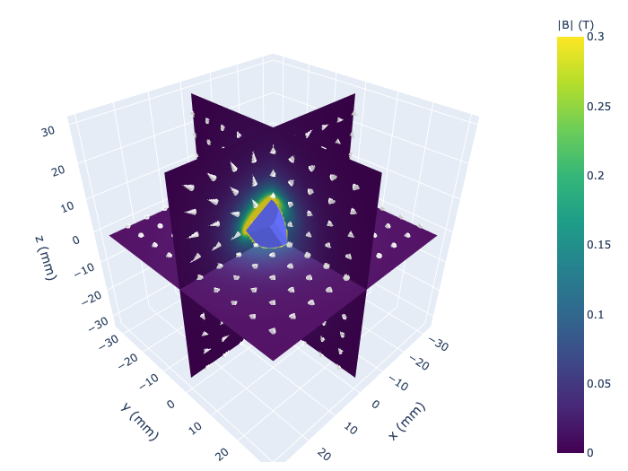
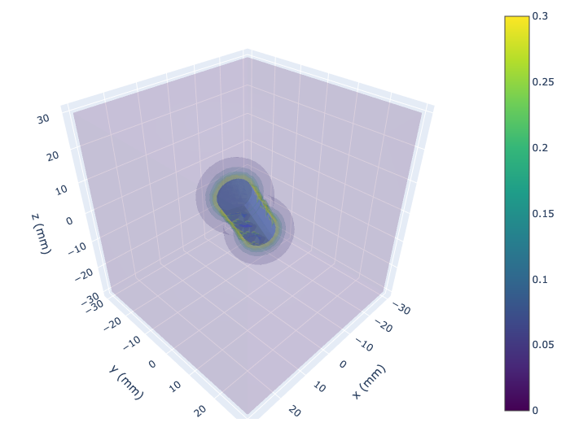
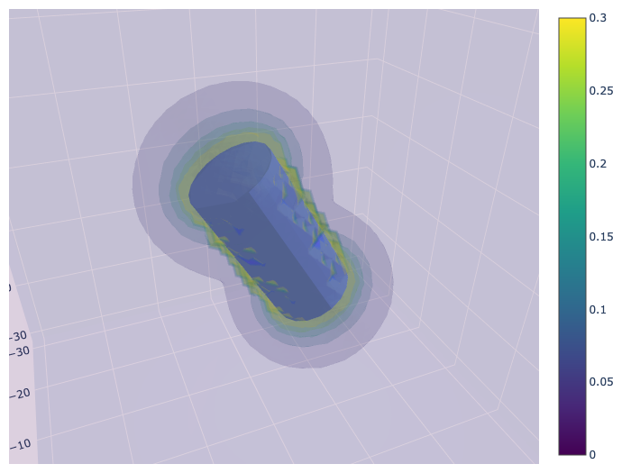
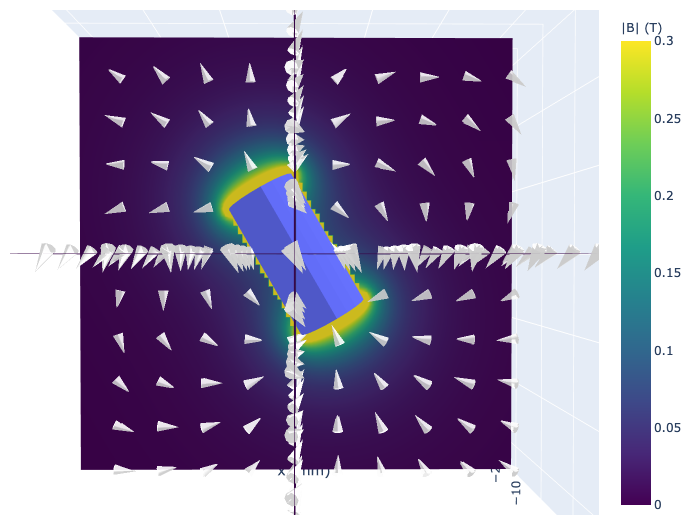

# 3D Plotting

All 3D plotting functions use **plotly** as the backend, providing interactive visualizations that can be rotated, zoomed, and panned.

## Dependencies

These functions require plotly to be installed:

```bash
pip install plotly
```

## Available Functions

| Function | Description |
|----------|-------------|
| `plot_magnet()` | Render 3D magnets only (no field) |
| `slice_plot()` | Plot pre-calculated field data on 2D slices |
| `slice_quickplot()` | Calculate and plot field on 2D slices in one step |
| `volume_plot()` | Plot pre-calculated field data as 3D volume |
| `volume_quickplot()` | Calculate and plot field as 3D volume in one step |

---

## `plot_magnet`

Renders all instantiated 3D magnets as interactive plotly meshes.

```python
from pymagnet.plots import plot_magnet
```

**Parameters:**

| Parameter | Type | Default | Description |
|-----------|------|---------|-------------|
| `unit` | str | `"mm"` | Unit label for axis titles |
| `magnet_opacity` | float | `1.0` | Opacity of rendered magnets (0.0 to 1.0) |

**Returns:**

| Type | Description |
|------|-------------|
| `Figure` | Plotly figure object |

**Example:**

```python
import pymagnet as pm
from pymagnet.plots import plot_magnet

pm.reset_magnets()
pm.magnets.Prism(Jr=1.0, center=(0, 0, 0), size=(10, 10, 5))
pm.magnets.Cylinder(Jr=1.0, center=(20, 0, 0), radius=5, length=10)

fig = plot_magnet(unit="mm", magnet_opacity=0.8)
```

<figure>
  
  <figcaption>3D rendering of a prism magnet</figcaption>
</figure>

---

## Slice Plots

Slice plots display 2D cross-sections of the magnetic field in 3D space. These are useful for visualizing field distributions on specific planes (XY, XZ, or YZ).

### `slice_plot`

Plots magnetic field data on pre-calculated slices. Use this when you have already computed the field data and want more control over the calculation.

```python
from pymagnet.plots import slice_plot
```

**Parameters:**

| Parameter | Type | Default | Description |
|-----------|------|---------|-------------|
| `data_dict` | dict | required | Dictionary containing slice data (see format below) |
| `opacity` | float | `0.8` | Opacity of field surface |
| `magnet_opacity` | float | `1.0` | Opacity of rendered magnets |
| `cone_opacity` | float | `1.0` | Opacity of vector cones |
| `cmin` | float | `0` | Minimum value for colorscale |
| `cmax` | float | `0.5` | Maximum value for colorscale |
| `colorscale` | str | `"viridis"` | Plotly colorscale name |
| `num_arrows` | int | `None` | Number of vector arrows to display (None = no arrows) |
| `show_magnets` | bool | `True` | Whether to render magnets |

**Data Dictionary Format:**

```python
data_dict = {
    "xy": {"points": Point_Array3, "field": Field3},
    "xz": {"points": Point_Array3, "field": Field3},
    "yz": {"points": Point_Array3, "field": Field3},
}
```

**Returns:**

| Type | Description |
|------|-------------|
| `tuple[Figure, list]` | Plotly figure and list of data objects |

**Example:**

```python
import pymagnet as pm
from pymagnet.utils import slice3D, get_field_3D
from pymagnet.plots import slice_plot

pm.reset_magnets()
pm.magnets.Prism(Jr=1.0, center=(0, 0, 0), size=(10, 10, 5))

# Calculate field on XY plane at z=0
points = slice3D(plane="xy", max1=20, max2=20, slice_value=0, num_points=50)
field = get_field_3D(points)

data_dict = {"xy": {"points": points, "field": field}}
fig, data_objects = slice_plot(data_dict, cmin=0, cmax=0.3)
```

---

### `slice_quickplot`

Convenience function that calculates the magnetic field and plots slices in one step.

```python
from pymagnet.plots import slice_quickplot
```

**Parameters:**

| Parameter | Type | Default | Description |
|-----------|------|---------|-------------|
| `max1` | float | `30` | Maximum value for first axis |
| `max2` | float | `30` | Maximum value for second axis |
| `min1` | float | `-max1` | Minimum value for first axis |
| `min2` | float | `-max2` | Minimum value for second axis |
| `slice_value` | float | `0.0` | Position of slice on the third axis |
| `unit` | str | `"mm"` | Unit label for axes |
| `num_points` | int | `100` | Number of points per axis |
| `planes` | list | `["xy", "xz", "yz"]` | List of planes to plot |
| `opacity` | float | `0.8` | Opacity of field surface |
| `magnet_opacity` | float | `1.0` | Opacity of rendered magnets |
| `cone_opacity` | float | `1.0` | Opacity of vector cones |
| `cmin` | float | `0` | Minimum value for colorscale |
| `cmax` | float | `0.5` | Maximum value for colorscale |
| `colorscale` | str | `"viridis"` | Plotly colorscale name |
| `num_arrows` | int | `None` | Number of vector arrows per axis |
| `show_magnets` | bool | `True` | Whether to render magnets |

**Returns:**

| Type | Description |
|------|-------------|
| `tuple[Figure, dict, list]` | Plotly figure, cached data dictionary, and list of data objects |

**Example:**

```python
import pymagnet as pm
from pymagnet.plots import slice_quickplot

pm.reset_magnets()
pm.magnets.Prism(Jr=1.0, center=(0, 0, 0), size=(10, 10, 5))

fig, cache, data_objects = slice_quickplot(
    max1=20,
    max2=20,
    planes=["xy", "xz"],
    cmin=0,
    cmax=0.3,
    num_arrows=10,
)
```

<figure>
  
  <figcaption>Slice plot showing XY and XZ planes through a prism magnet</figcaption>
</figure>

!!! note
    The `cache` return value contains the calculated `points` and `field` data for each plane, which can be reused for further analysis or re-plotting with different visualization settings.

---

## Volume Plots

Volume plots display the magnetic field as a 3D isosurface visualization, showing regions of equal field magnitude.

### `volume_plot`

Plots magnetic field data as a 3D volume. Use this when you have already computed the field data on a 3D grid.

```python
from pymagnet.plots import volume_plot
```

**Parameters:**

| Parameter | Type | Default | Description |
|-----------|------|---------|-------------|
| `points` | Point_Array3 | required | 3D coordinate grid |
| `field` | Field3 | required | Magnetic field data |
| `opacity` | float | `0.3` | Overall opacity of volume |
| `opacityscale` | str/list | `None` | Opacity scaling (`"normal"`, `"invert"`, or custom list) |
| `magnet_opacity` | float | `1.0` | Opacity of rendered magnets |
| `cone_opacity` | float | `1.0` | Opacity of vector cones |
| `cmin` | float | `0` | Minimum value for colorscale |
| `cmax` | float | `0.5` | Maximum value for colorscale |
| `num_levels` | int | `5` | Number of isosurface levels |
| `colorscale` | str | `"viridis"` | Plotly colorscale name |
| `num_arrows` | int | `None` | Number of vector arrows |
| `show_magnets` | bool | `True` | Whether to render magnets |

**Returns:**

| Type | Description |
|------|-------------|
| `tuple[Figure, list]` | Plotly figure and list of data objects |

**Example:**

```python
import pymagnet as pm
from pymagnet.utils import grid3D, get_field_3D
from pymagnet.plots import volume_plot

pm.reset_magnets()
pm.magnets.Sphere(Jr=1.0, center=(0, 0, 0), radius=5)

points = grid3D(xmax=15, ymax=15, zmax=15, num_points=30)
field = get_field_3D(points)

fig, data_objects = volume_plot(
    points, field,
    cmin=0, cmax=0.2,
    num_levels=8,
    opacity=0.2,
)
```

---

### `volume_quickplot`

Convenience function that calculates the magnetic field on a 3D grid and plots it in one step.

```python
from pymagnet.plots import volume_quickplot
```

**Parameters:**

| Parameter | Type | Default | Description |
|-----------|------|---------|-------------|
| `num_points` | int | `30` | Number of points per axis |
| `unit` | str | `"mm"` | Unit label for axes |
| `xmax` | float | `30` | Maximum x value |
| `ymax` | float | `30` | Maximum y value |
| `zmax` | float | `30` | Maximum z value |
| `xmin` | float | `-xmax` | Minimum x value |
| `ymin` | float | `-ymax` | Minimum y value |
| `zmin` | float | `-zmax` | Minimum z value |
| `opacity` | float | `0.3` | Overall opacity of volume |
| `opacityscale` | str/list | `None` | Opacity scaling |
| `magnet_opacity` | float | `1.0` | Opacity of rendered magnets |
| `cone_opacity` | float | `1.0` | Opacity of vector cones |
| `cmin` | float | `0` | Minimum value for colorscale |
| `cmax` | float | `0.5` | Maximum value for colorscale |
| `num_levels` | int | `5` | Number of isosurface levels |
| `colorscale` | str | `"viridis"` | Plotly colorscale name |
| `num_arrows` | int | `None` | Number of vector arrows |
| `show_magnets` | bool | `True` | Whether to render magnets |

**Returns:**

| Type | Description |
|------|-------------|
| `tuple[Figure, dict, list]` | Plotly figure, cached data dictionary, and list of data objects |

**Example:**

```python
import pymagnet as pm
from pymagnet.plots import volume_quickplot

pm.reset_magnets()
pm.magnets.Cylinder(Jr=1.0, center=(0, 0, 0), radius=5, length=10)

fig, cache, data_objects = volume_quickplot(
    xmax=20, ymax=20, zmax=20,
    num_points=25,
    cmin=0, cmax=0.3,
    num_levels=6,
    opacityscale="normal",
)
```

<figure>
  
  <figcaption>Volume plot showing magnetic field magnitude around a cylinder magnet</figcaption>
</figure>

---

## Opacity Scaling

The `opacityscale` parameter in volume plots controls how opacity varies with field magnitude:

- `"normal"`: Higher field values are more opaque
- `"invert"`: Lower field values are more opaque (useful for seeing into strong-field regions)
- Custom list: Define your own opacity mapping as `[[value, opacity], ...]`

**Example with inverted opacity:**

```python
fig, cache, data_objects = volume_quickplot(
    xmax=20, ymax=20, zmax=20,
    opacityscale="invert",
    cmin=0, cmax=0.5,
)
```

<figure>
  
  <figcaption>Volume plot with inverted opacity scale</figcaption>
</figure>

---

## Vector Arrows

Both slice and volume plots support displaying vector arrows (cones) to show field direction:

```python
fig, cache, data_objects = slice_quickplot(
    max1=20,
    max2=20,
    planes=["xy"],
    num_arrows=8,      # Display 8 arrows per axis
    cone_opacity=0.9,  # Make arrows slightly transparent
)
```

<figure>
  
  <figcaption>Slice plot with vector arrows showing field direction</figcaption>
</figure>

!!! note
    The `num_arrows` parameter controls the density of arrows. Setting it too high may clutter the visualization, while too low may not adequately represent the field direction.

---

## Tips

1. **Performance**: Volume plots with high `num_points` values can be slow. Start with 20-30 points and increase as needed.

2. **Color scaling**: Adjust `cmin` and `cmax` to highlight the field range of interest. Values outside this range will be clipped.

3. **Interactivity**: All plotly figures are interactive. Use mouse controls to rotate, zoom, and pan the 3D view.

4. **Exporting**: Save figures using `fig.write_html("output.html")` for interactive HTML or `fig.write_image("output.png")` for static images.
